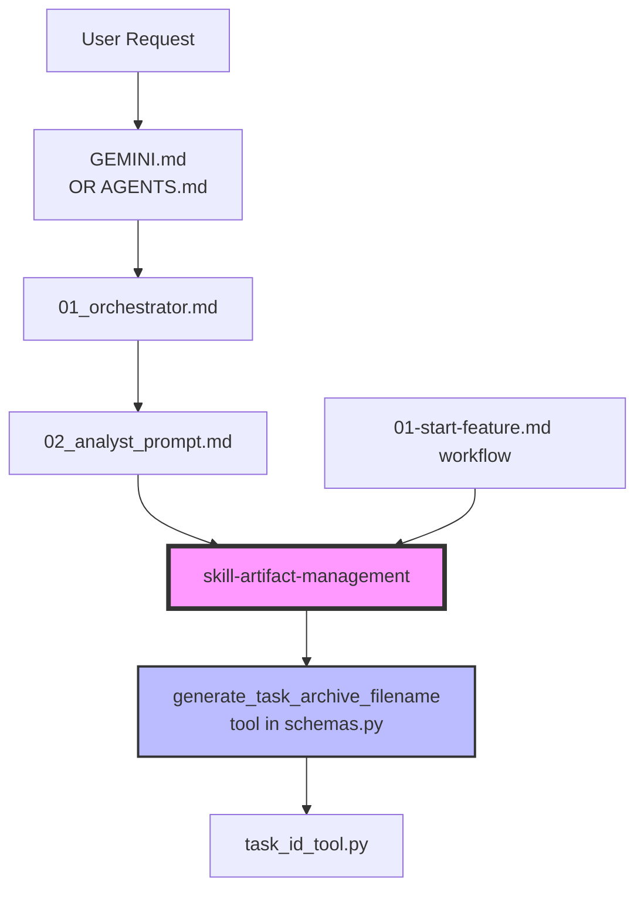

# Анализ и рекомендации по доработке фреймворка (v3.2.6+)

> **Статус:** Верификация завершена 2026-01-19  
> **Последнее обновление:** v3.4.0 Released

---

## Оглавление

- [Дорожная карта](#-дорожная-карта)
- [v3.3.x — Инкапсуляция архивации](#v33x--инкапсуляция-архивации-done)
- [v3.4 — VDD Multi-Adversarial](#v34--vdd-multi-adversarial-done)
- [v3.5 — Автоматизация памяти](#v35--автоматизация-памяти-planned)
- [v3.6 — Экосистема](#v36--экосистема)
- [Архив: Первоначальный анализ](#архив-первоначальный-анализ)

---

## 📋 Дорожная карта

| Версия | Изменения | Статус | Ссылка |
|--------|-----------|--------|--------|
| **v3.3.0** | `skill-archive-task` + `skill-safe-commands` + рефакторинг дублирования | ✅ Released | [→ Детали](#v330-skill-encapsulation) |
| **v3.3.1** | Portability fixes, VDD Audit, UX improvements | ✅ Released | [→ Детали](#v331-portability-fixes) |
| **v3.3.2** | Auto-tests для протокола архивации (15 тестов) | ✅ Released | [→ Детали](#v332-auto-tests) |
| **v3.4** | VDD multi-adversarial + новые adversarial skills | ✅ Released | [→ Детали](#v34--vdd-multi-adversarial-done) |
| **v3.5** | `skill-update-memory`, `skill-reverse-engineering` | ✅ Released | [→ Детали](#v35--автоматизация-памяти-done) |
| **v3.6** | Installer + examples + documentation polish | 🔵 Низкий | [→ Детали](#v36--экосистема) |

---

## v3.3.x — Инкапсуляция архивации (DONE)

### v3.3.0: Skill Encapsulation

**Проблема:** Логика архивации TASK.md дублировалась в 6+ файлах.

**Решение:**
| Компонент | Статус |
|-----------|--------|
| `skill-archive-task` — полный 6-шаговый протокол | ✅ Done |
| `skill-safe-commands` — единый источник истины | ✅ Done |
| Рефакторинг ссылок в 6 файлах | ✅ Done |

**Ключевые файлы:**
- `.agent/skills/skill-archive-task/SKILL.md`
- `.agent/skills/skill-safe-commands/SKILL.md`

---

### v3.3.1: Portability Fixes

| Исправление | Статус |
|-------------|--------|
| Circular Logic в Safe Commands | ✅ Fixed |
| Phantom tool references в orchestrator | ✅ Fixed |
| Portability: `System/Docs/ORCHESTRATOR.md` optional | ✅ Done |

---

### v3.3.2: Auto-Tests

**Реализовано:**
- 15 automated tests (4 core + 4 VDD adversarial)
- `archive_protocol.py` — тестируемая реализация протокола
- Test fixtures в `.agent/tools/fixtures/`

**Запуск:**
```bash
cd .agent/tools && python -m pytest test_archive_protocol.py -v
```

**Покрытие сценариев:**
| # | Сценарий | Статус |
|---|----------|--------|
| 1 | Новая задача + существующий TASK | ✅ Автотест |
| 5 | Новая задача, TASK не существует | ✅ Автотест |
| 6 | Уточнение (без архивации) | ✅ Автотест |
| 8 | Конфликт ID | ✅ Автотест |
| 2,3,4,7 | Эквивалентны на уровне протокола | ⏭️ Skipped |

---

## v3.4 — VDD Multi-Adversarial (DONE)

**Цель:** Расширить VDD последовательным запуском нескольких критиков.

### Что нужно создать

| Компонент | Описание | Статус |
|-----------|----------|--------|
| `skill-adversarial-security` | OWASP-критик в adversarial-стиле | ✅ Done |
| `skill-adversarial-performance` | Критик производительности | ✅ Done |
| `workflow vdd-multi` | Последовательный запуск критиков | ✅ Done |

### Существующая база

| Компонент | Статус |
|-----------|--------|
| `skill-vdd-adversarial` | ✅ Работает |
| `skill-vdd-sarcastic` | ✅ Работает |
| `skill-security-audit` | ✅ Работает |
| `workflow vdd-adversarial.md` | ✅ Работает |
| `workflow full-robust.md` | ✅ Nested: enhanced + security |

### Предлагаемая архитектура

```
/vdd-multi (новый workflow)
 ├── Iteration 1: skill-vdd-adversarial
 ├── Iteration 2: skill-adversarial-security
 └── Iteration 3: skill-adversarial-performance
```

---

## v3.5 — Автоматизация памяти (DONE)

**Цель:** Исключить человеческий фактор при поддержании актуальности документации и памяти агентов.

### 1. Skill: Update Memory (`skill-update-memory`)

**Проблема:**
Агенты и разработчики забывают обновлять файлы `.AGENTS.md` после изменения кода. Это приводит к "амнезии" системы в следующих сессиях.

**Решение:**
Навык, который анализирует изменения в коде и предлагает обновления для `.AGENTS.md`.

*   **Вход:** Вывод `git diff --staged` или список измененных файлов.
*   **Логика:**
    1.  **Фильтрация:** Игнорировать документацию, конфиги, авто-генерируемые файлы. Учитывать только **исходный код** (src/, logic/).
    2.  Для каждого измененного файла определить целевой `.AGENTS.md` (в текущей папке или **в корне проекта**).
    3.  Если файл новый — добавить запись в `.AGENTS.md`.
    4.  Если файл удален — пометить как (Deleted).
    5.  Если изменилась логика — обновить описание.
*   **Интеграция:** Добавить шаг вызова этого навыка в `09_agent_code_reviewer` перед апрувом или в `04-update-docs`.

### 2. Skill: Reverse Engineering (`skill-reverse-engineering`)

**Проблема:**
После "быстрых правок" руками или серии багфиксов, документация (`ARCHITECTURE.md`, `TASK.md`) рассинхронизируется с кодом.

**Решение:**
Навык для восстановления ментальной модели проекта из кода.

*   **Функции**:
    *   Генерация `docs/ARCHITECTURE.md` по текущему коду (восстановление карты классов/модулей).
    *   Выявление "скрытых знаний" (неочевидные решения, костыли) для записи в `docs/KNOWN_ISSUES.md`.
*   **Сценарий:** Используется, когда агент получает задачу и видит несоответствие документации и кода.

### Критерии приемки (DoD)
1.  Создан `skill-update-memory/SKILL.md`.
2.  Создан `skill-reverse-engineering/SKILL.md`.
3.  Обновлен `System/Docs/SKILLS.md`.
4.  Проверен сценарий: изменение файла -> запуск скилла -> `.AGENTS.md` обновлен.
### VDD Verification (Risks & Mitigations)
> **VDD Critic:** "Nice plan, but reality is harsher. Here is how it will fail:"

1.  **Risk: Context Overflow (Reverse Engineering)**
    *   *Critique:* "Feeding 50k lines of code into context to generate Architecture? Good luck with usage limits."
    *   *Mitigation:* **Iterative Strategy.** Analyze folder-by-folder, generate local summaries, then synthesize global Architecture.

2.  **Risk: Hallucination & Noise (Update Memory)**
    *   *Critique:* "Git diff shows a 1000-line change in `package-lock.json`. Agent decides it's 'Dependencies Logic' and writes hallucinated summary."
    *   *Mitigation:* **Strict Filtering.** Ignored list must include `*.lock`, `*.min.js`, `dist/`, `migrations/`.

3.  **Risk: Overwriting Human Wisdom**
    *   *Critique:* "I wrote a nuance about *why* we use this weird hack in `.AGENTS.md`. Agent deletes it and replaces with 'Refactored function X'."
    *   *Mitigation:* **Append/Refine Mode.** Never delete manual sections marked as `[Human Knowledge]`. Or use Pull Request model for memory updates.

---
---

## v3.6 — Экосистема

- **Installer script** (`setup.sh`): После стабилизации структуры
- **Examples**: `examples/` с 2-3 готовыми проектами
- **Skills Catalog**: Расширение `System/Docs/SKILLS.md`

---

## Архив: Первоначальный анализ

> Этот раздел содержит оригинальный анализ дублирования, выполненный до рефакторинга.
> Сохранён для исторической справки.

<details>
<summary>Показать оригинальный анализ</summary>

### Дублирование логики архивации (УСТРАНЕНО)

Логика архивации TASK.md дублировалась в 6+ местах:

| Файл | Строки | Что содержит |
|------|--------|--------------|
| `GEMINI.md` | 56-58 | Полное описание протокола + вызов tool |
| `AGENTS.md` | 36-38 | Сокращённое описание + вызов tool |
| `artifact-management/SKILL.md` | 33-55 | Полный протокол (источник истины) |
| `02_analyst_prompt.md` | 24-35 | CRITICAL PRE-FLIGHT CHECKLIST |
| `01_orchestrator.md` | 57-69 | DECISION LOGIC для нового vs refinement |
| `01-start-feature.md` workflow | 6-10 | Archiving (CRITICAL) секция |

### Зависимости между файлами



### Safe Commands дублирование (УСТРАНЕНО)

| Файл | Строки |
|------|--------|
| `GEMINI.md` | 21-26 |
| `AGENTS.md` | 24-28 |
| `artifact-management/SKILL.md` | 57-69 |
| `01_orchestrator.md` | 35-40 |

**Решение:** Создан `skill-safe-commands` как единый источник истины.

</details>

---

## Финальные рекомендации

1. ✅ ~~Создать `skill-archive-task`~~ — DONE
2. ✅ ~~Создать `skill-safe-commands`~~ — DONE
3. ✅ ~~Auto-tests для протокола~~ — DONE (15 тестов)
4. ✅ ~~VDD multi-adversarial~~ — DONE
5. **Не усложнять tools** — schemas.py + native IDE tools достаточно
6. **Документация > код** — skills = документация для агентов