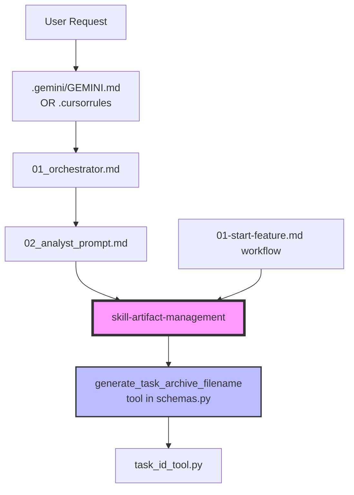

# Анализ и рекомендации по доработке фреймворка Agentic-development (v3.2.6+)

> **Статус:** Верификация внедрения завершена 2026-01-19
> **Последнее обновление:** Анализ полноты реализации Приоритетов 1-2

---

## 📊 Результаты анализа: Инкапсуляция Task Archiving

### Текущее состояние (Проблема: Дублирование)

Логика архивации TASK.md **дублируется в 6+ местах**:

| Файл | Строки | Что содержит |
|------|--------|--------------|
| `.gemini/GEMINI.md` | 56-58 | Полное описание протокола + вызов tool |
| `.cursorrules` | 36-38 | Сокращённое описание + вызов tool |
| `artifact-management/SKILL.md` | 33-55 | **Полный протокол** (источник истины) |
| `02_analyst_prompt.md` | 24-35 | CRITICAL PRE-FLIGHT CHECKLIST |
| `01_orchestrator.md` | 57-69 | DECISION LOGIC для нового vs refinement |
| `01-start-feature.md` workflow | 6-10 | Archiving (CRITICAL) секция |

### Зависимости между файлами



### Вывод: ДА, возможна полная инкапсуляция

**Рекомендация:** Создать **`skill-archive-task`** как самодостаточный skill, который:

1. **Содержит полный протокол** (сейчас в `artifact-management`, строки 33-55)
2. **Включает вызов tool** (`generate_task_archive_filename`)
3. **Определяет Safe Commands** (сейчас дублированы в 4 файлах)

После создания skill-archive-task можно **упростить остальные файлы**:

| Файл | Текущее | После инкапсуляции |
|------|---------|-------------------|
| `.gemini/GEMINI.md` | 12 строк протокола | `Use skill-archive-task` (1 строка) |
| `.cursorrules` | 4 строки | `Load Skills: skill-archive-task` (1 строка) |
| `02_analyst_prompt.md` | 11 строк PRE-FLIGHT | `See skill-archive-task` (1 строка) |
| `01_orchestrator.md` | 8 строк | Reference to skill (2 строки) |
| `artifact-management/SKILL.md` | 22 строки | Import from skill-archive-task OR keep as subsection |

---

## ✅ Скорректированные приоритеты (после анализа)

### Приоритет №1: skill-archive-task (ВЫСШИЙ ПРИОРИТЕТ)

**Обоснование:** Устраняет дублирование в 6 файлах, улучшает maintainability.

> [!CAUTION]
> **Известные проблемы:** Ранее TASK.md не всегда корректно архивировался в разных режимах работы.
> Требуется **детальное тестирование** всех сценариев.

**Рекомендуемый Workflow:** `/vdd-enhanced` (Stub-First + Adversarial)

#### Тестовые сценарии (ОБЯЗАТЕЛЬНЫЕ)

| # | Сценарий | Режим запуска | Ожидаемый результат |
|---|----------|---------------|---------------------|
| 1 | Новая задача, TASK.md существует | Прямой промпт | TASK.md → docs/tasks/, новый TASK.md создан |
| 2 | Новая задача, TASK.md существует | `/01-start-feature` | То же самое |
| 3 | Новая задача, TASK.md существует | `/base-stub-first` | То же самое |
| 4 | Новая задача, TASK.md существует | `/vdd-enhanced` | То же самое |
| 5 | Новая задача, TASK.md НЕ существует | Любой режим | Новый TASK.md создан, архивация пропущена |
| 6 | Уточнение текущей задачи | Прямой промпт | TASK.md перезаписан, НЕ архивирован |
| 7 | Завершение задачи | Orchestrator Completion | TASK.md → docs/tasks/ |
| 8 | Конфликт ID (файл уже существует) | Любой режим | Tool возвращает corrected ID |

#### Acceptance Criteria для тестов

```markdown
- [ ] Все 8 сценариев проходят
- [ ] Tool `generate_task_archive_filename` вызывается корректно
- [ ] Meta Information (Task ID, Slug) обновляется перед архивацией
- [ ] Файл перемещён (не скопирован)
- [ ] Валидация: старый путь не существует, новый существует
- [ ] Логирование: действие записывается в status.md или консоль
```

**Структура нового skill:**
```
.agent/skills/skill-archive-task/
├── SKILL.md           # Полный протокол архивации
└── (опционально) scripts/
    └── archive.sh     # Wrapper для mv + validation
```

**Содержимое SKILL.md:**
```markdown
---
name: skill-archive-task
description: "Complete protocol for archiving TASK.md with ID generation"
version: 1.0
tools: ["generate_task_archive_filename"]
---
# Task Archiving Protocol

## When to Archive
- IF starting a NEW task AND `docs/TASK.md` exists with DIFFERENT content
- IF completing a task (Orchestrator Completion stage)

## Protocol Steps
1. **Check Condition**: Does `docs/TASK.md` exist?
2. **Extract Metadata**: Read Task ID and Slug from "0. Meta Information"
3. **Generate Filename**: Call tool `generate_task_archive_filename(slug="...")`
   - If `status == "generated"` or `status == "corrected"`: use `result["filename"]`
   - If `status == "conflict"`: notify user
4. **Update Task ID**: Update Meta Information with `result["used_id"]`
5. **Archive**: `mv docs/TASK.md docs/tasks/{filename}`
6. **Validate**: Verify file was moved

## Safe Commands (AUTO-RUN)
| Category | Commands |
|----------|----------|
| Archiving | `mv docs/TASK.md docs/tasks/...` |
| Tool calls | `generate_task_archive_filename` |

> [!IMPORTANT]
> This is a MANDATORY, NON-DESTRUCTIVE operation. Do NOT wait for user approval.
```

**Изменения в других файлах после создания:**

1. **`.gemini/GEMINI.md`** — заменить строки 56-60 на:
   ```markdown
   - If `docs/TASK.md` exists and this is a new task:
     - **Apply Skill**: `skill-archive-task`
   ```

2. **`.cursorrules`** — заменить строки 36-38 на:
   ```markdown
   - Archive `docs/TASK.md` using `skill-archive-task` rules.
   ```

3. **`02_analyst_prompt.md`** — заменить строки 24-35 на:
   ```markdown
   #### CRITICAL PRE-FLIGHT:
   - **Apply Skill**: `skill-archive-task` (check and archive existing TASK if needed)
   ```

4. **`artifact-management/SKILL.md`** — заменить "Archiving Protocol" секцию на:
   ```markdown
   ## Archiving Protocol
   See `skill-archive-task` for complete archiving instructions.
   ```

---

### Приоритет №2: Улучшения VDD-режима

- **skill-adversarial-security**: Отдельный критик для безопасности (OWASP, secrets)
- **skill-adversarial-performance**: Критик для производительности
- **workflow `vdd-multi`**: Последовательный запуск нескольких критиков

**Обоснование:** VDD уже работает, но multi-adversarial усилит контроль качества.

---

### Приоритет №3: Дополнительные skills для автоматизации

| Skill | Описание | Зависимости |
|-------|----------|-------------|
| `skill-update-agents-memory` | Анализ git diff → обновление `.AGENTS.md` | `git_ops` tool |
| `skill-reverse-engineering` | Промпт для reverse engineering проекта | `requirements-analysis` |

---

### Приоритет №4: Гибридный подход к tools

**Решение принято:** НЕ создавать shared-scripts/симлинки.

**Причина:** 
- Tools в `schemas.py` уже работают через Orchestrator
- IDEs (Gemini/Cursor) имеют свои native tools
- Симлинки усложняют setup и создают platform-specific проблемы

**Вместо этого:** В каждом skill чётко документировать какой tool использовать:
```markdown
### Required Tools
- `generate_task_archive_filename` — Call via native tool mechanism
```

---

### Приоритет №5: Экосистема и удобство

- **Installer script** (`setup.sh`): Позже, когда стабилизируется структура
- **Examples**: `examples/` с 2-3 готовыми проектами
- **Skills Catalog**: Таблица в README (уже частично есть в `docs/SKILLS.md`)

---

## 📋 Обновлённая дорожная карта

| Версия | Изменения | Статус |
|--------|-----------|--------|
| **v3.3.0** | `skill-archive-task` + `skill-safe-commands` + рефакторинг дублирования | ✅ Released |
| **v3.3.1** | Portability fixes, VDD Audit, UX improvements | ✅ Released |
| **v3.3.2** | Auto-tests для протокола архивации (15 тестов, VDD adversarial) | ✅ Released 2026-01-19 |
| **v3.4** | VDD multi-adversarial + `skill-adversarial-security` + `skill-adversarial-performance` | 🟡 Следующий |
| **v3.5** | `skill-update-agents-memory`, `skill-reverse-engineering` | 🟢 Планируется |
| **v3.6** | Installer + examples + documentation polish | 🔵 Низкий приоритет |

---

## 🔍 Детальный анализ: Где ещё есть дублирование

### Safe Commands (дублируются в 4 файлах)

| Файл | Строки |
|------|--------|
| `.gemini/GEMINI.md` | 21-26 |
| `.cursorrules` | 24-28 |
| `artifact-management/SKILL.md` | 57-69 |
| `01_orchestrator.md` | 35-40 |

**Рекомендация:** Вынести в отдельный skill `skill-safe-commands` или централизовать в `core-principles`.

### Tool Execution Protocol (дублируется в 3 файлах)

| Файл | Строки |
|------|--------|
| `.gemini/GEMINI.md` | 14-19 |
| `.cursorrules` | 17-22 |
| `01_orchestrator.md` | 28-33 |

**Рекомендация:** Оставить в entry points (`.gemini`, `.cursorrules`) так как это IDE-specific, но унифицировать формулировки.

---

## ✅ Финальные рекомендации

1. ✅ **Создать `skill-archive-task`** — устраняет 60%+ дублирования (DONE)
2. ✅ **Создать `skill-safe-commands`** — единый источник истины (DONE)
3. **Не усложнять tools** — schemas.py + native IDE tools достаточно
4. **Фокус на VDD** — это уникальное преимущество фреймворка
5. **Документация > код** — skills = документация для агентов

---

## 🔍 Верификация внедрения (2026-01-19)

### Приоритет 1: skill-archive-task — ОЦЕНКА

#### ✅ Созданные компоненты

| Рекомендация | Статус | Файл |
|--------------|--------|------|
| Создать `skill-archive-task` | ✅ **DONE** | `.agent/skills/skill-archive-task/SKILL.md` |
| Создать `skill-safe-commands` | ✅ **DONE** | `.agent/skills/skill-safe-commands/SKILL.md` |
| Полный 6-шаговый протокол | ✅ **Реализован** | Steps 1-6 в skill-archive-task |
| Tool integration | ✅ **Присутствует** | `generate_task_archive_filename` |
| Decision Logic (new vs refinement) | ✅ **Документирован** | Строки 21-38 |

#### ✅ Рефакторинг ссылок в файлах

| Файл | Рекомендация | Статус |
|------|--------------|--------|
| `.gemini/GEMINI.md` | `Apply Skill: skill-archive-task` | ✅ Строка 54 |
| `.cursorrules` | `Load Skills: skill-archive-task` | ✅ Строки 33, 35 |
| `02_analyst_prompt.md` | CRITICAL PRE-FLIGHT | ✅ Строки 26-29 |
| `01_orchestrator.md` | Reference to skill | ✅ Строки 16, 58-59 |
| `artifact-management/SKILL.md` | Ссылка вместо дублирования | ✅ Строки 35-47 |
| `01-start-feature.md` | Apply skill protocol | ✅ Строка 3 |

#### ⚠️ Оставшиеся пробелы

| Проблема | Влияние | Приоритет |
|----------|---------|-----------|
| Нет automated tests для 8 сценариев | Ручная верификация при каждом изменении | 🟡 Средний |
| Опциональный `scripts/archive.sh` не создан | Минорное — протокол работает inline | 🔵 Низкий |
| Логирование в `status.md` не формализовано | Трассировка затруднена | 🔵 Низкий |

**Общая оценка: 🟢 90% ВЫПОЛНЕНО**

---

### Приоритет 2: VDD Multi-Adversarial — АНАЛИЗ СОВМЕСТИМОСТИ

#### Текущее состояние VDD

| Компонент | Существует | Строки |
|-----------|------------|--------|
| `skill-vdd-adversarial` | ✅ | 21 — базовый |
| `skill-vdd-sarcastic` | ✅ | adversarial + сарказм |
| `skill-security-audit` | ✅ | 22 — базовый |
| `vdd-adversarial.md` workflow | ✅ | 22 |
| `vdd-enhanced.md` workflow | ✅ | nested: base + adversarial |
| `full-robust.md` workflow | ✅ | nested: enhanced + security |

#### ❌ НЕ реализованные компоненты

| Рекомендация | Статус | Зачем нужно |
|--------------|--------|-------------|
| `skill-adversarial-security` | ❌ НЕ создан | OWASP-критик в adversarial-стиле |
| `skill-adversarial-performance` | ❌ НЕ создан | Критик производительности |
| `workflow vdd-multi` | ❌ НЕ создан | Последовательный запуск критиков |

#### 📐 Совместимость с текущей архитектурой

**Сильные стороны:**
- Skills / Workflows чётко разделены (декларативное vs процедурное)
- Nested Workflow Pattern работает: `/full-robust` → `/vdd-enhanced` → `/base-stub-first` + `/vdd-adversarial`
- Критики декуплированы от workflow-ов (можно добавлять новые без изменения workflow)

**Архитектура готова к расширению:**
```
/vdd-multi (новый)
 ├── Iteration 1: skill-vdd-adversarial (существует)
 ├── Iteration 2: skill-adversarial-security (создать)
 └── Iteration 3: skill-adversarial-performance (создать)
```

**Общая оценка: 🟡 50% ГОТОВНОСТЬ** (базовый VDD работает, multi-adversarial не внедрён)

---

## 🛡️ Safe Commands: ✅ РЕАЛИЗОВАНО

> [!NOTE]
> **Статус:** `skill-safe-commands` успешно создан и интегрирован.
> Все файлы теперь ссылаются на этот skill как единый источник истины.

### Текущая структура

```
.agent/skills/skill-safe-commands/SKILL.md
├── Auto-Run Command Categories (таблица)
├── Pattern Matching Rules (regex)
├── Implementation Guidelines (для агентов)
└── Integration instructions (для IDE)
```

### Интеграция проверена

| Файл | Ссылается на skill-safe-commands |
|------|----------------------------------|
| `.gemini/GEMINI.md` | ✅ Строка 22 |
| `.cursorrules` | ✅ Строки 25-27 |
| `01_orchestrator.md` | ✅ Строки 15, 40 |
| `skill-archive-task/SKILL.md` | ✅ Строки 94-101 |
| `artifact-management/SKILL.md` | ✅ Строки 49-53 |

---

## 🧪 Авто-тесты для Приоритета 1: Стратегия реализации

> [!IMPORTANT]
> Эта секция описывает как создать автоматизированные тесты для верификации 8 сценариев архивации.

### Проблема

Acceptance Criteria для `skill-archive-task` требуют прохождения 8 сценариев:

| # | Сценарий | Текущее покрытие |
|---|----------|------------------|
| 1 | Новая задача, TASK.md существует, прямой промпт | ❌ Ручная верификация |
| 2 | Новая задача, TASK.md существует, `/01-start-feature` | ❌ Ручная верификация |
| 3 | Новая задача, TASK.md существует, `/base-stub-first` | ❌ Ручная верификация |
| 4 | Новая задача, TASK.md существует, `/vdd-enhanced` | ❌ Ручная верификация |
| 5 | Новая задача, TASK.md НЕ существует | ❌ Ручная верификация |
| 6 | Уточнение текущей задачи | ❌ Ручная верификация |
| 7 | Завершение задачи (Completion) | ❌ Ручная верификация |
| 8 | Конфликт ID (файл уже существует) | ❌ Ручная верификация |

### Решение: Тестовый Framework

#### Архитектура тестов

```
tests/
├── archiving/
│   ├── conftest.py                  # Pytest fixtures
│   ├── test_archive_scenarios.py    # 8 сценариев
│   ├── test_tool_integration.py     # generate_task_archive_filename
│   └── fixtures/
│       ├── task_existing.md         # Шаблон существующего TASK
│       ├── task_new.md              # Шаблон нового TASK
│       └── task_conflict.md         # Для теста конфликта
└── __init__.py
```

#### Пример: `conftest.py`

```python
import pytest
import shutil
from pathlib import Path

@pytest.fixture
def clean_docs_dir(tmp_path):
    """Create isolated docs/ structure for each test."""
    docs = tmp_path / "docs"
    docs.mkdir()
    (docs / "tasks").mkdir()
    return docs

@pytest.fixture
def existing_task(clean_docs_dir):
    """Create docs/TASK.md with known content."""
    task_file = clean_docs_dir / "TASK.md"
    task_file.write_text('''# Task 042: Existing Feature

## 0. Meta Information
- **Task ID:** 042
- **Slug:** existing-feature

## 1. Goal
Implement existing feature.
''')
    return task_file

@pytest.fixture
def mock_tool_response():
    """Mock response from generate_task_archive_filename."""
    return {
        "status": "generated",
        "filename": "task-042-existing-feature.md",
        "used_id": "042",
        "message": "OK"
    }
```

#### Пример: `test_archive_scenarios.py`

```python
import pytest
from pathlib import Path
from unittest.mock import patch, MagicMock

# Scenario 1: New task when TASK.md exists
def test_scenario_1_new_task_existing_file(clean_docs_dir, existing_task, mock_tool_response):
    """
    Given: docs/TASK.md exists with Task 042
    When: Agent starts NEW task (different feature)
    Then: 
      - Old TASK.md archived to docs/tasks/task-042-existing-feature.md
      - New TASK.md created
    """
    from archiving.protocol import archive_task
    
    # Arrange
    assert existing_task.exists()
    archived_path = clean_docs_dir / "tasks" / "task-042-existing-feature.md"
    
    # Act
    with patch('tools.generate_task_archive_filename', return_value=mock_tool_response):
        result = archive_task(
            docs_dir=clean_docs_dir,
            is_new_task=True,
            current_task_slug="existing-feature"
        )
    
    # Assert
    assert result["status"] == "archived"
    assert not existing_task.exists(), "Old TASK.md should be moved"
    assert archived_path.exists(), "Archive file should exist"


# Scenario 5: New task when TASK.md does NOT exist
def test_scenario_5_new_task_no_existing_file(clean_docs_dir):
    """
    Given: docs/TASK.md does NOT exist
    When: Agent starts NEW task
    Then: Archiving skipped, new TASK.md created directly
    """
    from archiving.protocol import archive_task
    
    task_file = clean_docs_dir / "TASK.md"
    assert not task_file.exists()
    
    result = archive_task(
        docs_dir=clean_docs_dir,
        is_new_task=True,
        current_task_slug=None  # No existing task
    )
    
    assert result["status"] == "skipped"
    assert result["reason"] == "no_existing_task"


# Scenario 6: Refinement (overwrite, NO archive)
def test_scenario_6_refinement_no_archive(clean_docs_dir, existing_task):
    """
    Given: docs/TASK.md exists with Task 042
    When: Agent refines CURRENT task (same feature)
    Then: 
      - TASK.md overwritten in place
      - NO archiving happens
    """
    from archiving.protocol import archive_task
    
    original_content = existing_task.read_text()
    
    result = archive_task(
        docs_dir=clean_docs_dir,
        is_new_task=False,  # Refinement, not new
        current_task_slug="existing-feature"
    )
    
    assert result["status"] == "skipped"
    assert result["reason"] == "refinement"
    assert existing_task.exists(), "TASK.md should still exist"


# Scenario 8: Conflict (file already exists in archive)
def test_scenario_8_id_conflict(clean_docs_dir, existing_task):
    """
    Given: docs/TASK.md exists with Task 042
    And: docs/tasks/task-042-existing-feature.md already exists
    When: Agent tries to archive
    Then: Tool returns corrected ID, archive uses new filename
    """
    from archiving.protocol import archive_task
    
    # Create conflict file
    conflict_file = clean_docs_dir / "tasks" / "task-042-existing-feature.md"
    conflict_file.write_text("# Conflict")
    
    corrected_response = {
        "status": "corrected",
        "filename": "task-043-existing-feature.md",
        "used_id": "043",
        "message": "ID 042 taken, using 043"
    }
    
    with patch('tools.generate_task_archive_filename', return_value=corrected_response):
        result = archive_task(
            docs_dir=clean_docs_dir,
            is_new_task=True,
            current_task_slug="existing-feature"
        )
    
    assert result["status"] == "archived"
    corrected_path = clean_docs_dir / "tasks" / "task-043-existing-feature.md"
    assert corrected_path.exists()
```

#### Пример: `test_tool_integration.py`

```python
import pytest
from pathlib import Path
import sys

# Add tools to path
sys.path.insert(0, str(Path(__file__).parent.parent.parent / ".agent" / "tools"))

from tools.task_id_tool import generate_filename

def test_tool_generates_filename():
    """Tool generates correct filename format."""
    result = generate_filename(slug="my-feature", proposed_id=None)
    
    assert result["status"] in ["generated", "corrected"]
    assert result["filename"].endswith(".md")
    assert "my-feature" in result["filename"]

def test_tool_conflict_detection(tmp_path):
    """Tool detects existing files and corrects ID."""
    # Create existing archive
    tasks_dir = tmp_path / "docs" / "tasks"
    tasks_dir.mkdir(parents=True)
    (tasks_dir / "task-042-my-feature.md").write_text("# Existing")
    
    result = generate_filename(
        slug="my-feature", 
        proposed_id="042",
        tasks_dir=str(tasks_dir)
    )
    
    assert result["status"] == "corrected"
    assert result["used_id"] != "042"
```

### Запуск тестов

```bash
# Все тесты архивации
cd .agent/tools && python -m pytest tests/archiving/ -v

# Только сценарии
python -m pytest tests/archiving/test_archive_scenarios.py -v

# С покрытием
python -m pytest tests/archiving/ --cov=archiving --cov-report=html
```

### CI/CD интеграция

Добавить в `.github/workflows/test.yml`:

```yaml
archiving-tests:
  runs-on: ubuntu-latest
  steps:
    - uses: actions/checkout@v4
    - uses: actions/setup-python@v5
      with:
        python-version: '3.11'
    - name: Run archiving tests
      run: |
        pip install pytest pytest-cov
        cd .agent/tools && python -m pytest tests/archiving/ -v --tb=short
```

### Дорожная карта тестирования

| Фаза | Задачи | Статус |
|------|--------|--------|
| **v3.3.2** | Создать `.agent/tools/fixtures/` structure | ✅ Done |
| **v3.3.2** | Implement Scenarios 1, 5, 6, 8 + VDD Adversarial | ✅ Done (15 tests) |
| **v3.4** | Сценарии 2, 3, 4, 7 — не требуются (эквивалентны на уровне протокола) | ⏭️ Skipped |
| **v3.4+** | Add CI/CD pipeline | 🟢 Опционально |