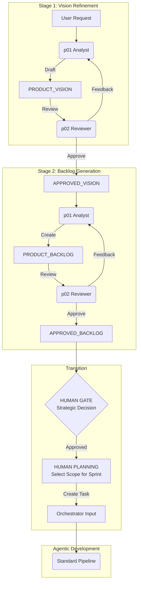

# Product Development Vision

> **Status:** Finalized Vision Document
> **Created:** 2026-01-21
> **Last Updated:** 2026-01-23
> **Purpose:** Target architecture for enterprise product development extension

---

## Table of Contents

- [Vision Statement](#vision-statement)
  - [Goals](#goals)
  - [Non-Goals](#non-goals)
- [Core Principles](#core-principles)
  - [1. Artifact-Centric Architecture](#1-artifact-centric-architecture)
  - [2. Sequential Sessions (Not Parallel Agents)](#2-sequential-sessions-not-parallel-agents)
  - [3. VDD at Every Level](#3-vdd-at-every-level)
  - [4. Token Budget Awareness](#4-token-budget-awareness)
- [Target Architecture](#target-architecture)
  - [Phase Model](#phase-model)
  - [Isolation & Handoff Strategy](#isolation--handoff-strategy)
  - [Artifact Flow](#artifact-flow)
- [Agent Model](#agent-model)
  - [New Agents (Minimal Set)](#new-agents-minimal-set)
  - [Rejected Agents](#rejected-agents)
- [Skills & Workflows](#skills-workflows)
  - [New Skills](#new-skills)
  - [New Workflows](#new-workflows)
- [Folder Structure](#folder-structure)
- [Detailed Implementation Plan](#detailed-implementation-plan)
  - [Prerequisites](#prerequisites)
  - [Phase 0: Product Bootstrap & Tools](#phase-0-product-bootstrap--tools-week-1)
  - [Phase 1: The Refinement Loop](#phase-1-the-refinement-loop-week-2)
  - [Phase 2: Standalone Mode](#phase-2-standalone-mode-startupsrfp-week-3)
  - [Phase 3: Technical Integration](#phase-3-technical-integration-week-4)
- [VDD Review](#vdd-review)
  - [Challenge 1: Business Metrics](#challenge-1-business-metrics-are-hard-to-verify)
  - [Challenge 3: Complexity](#challenge-3-another-layer-more-complexity)
  - [Challenge 4: Token Budget](#challenge-4-token-budget-will-be-exceeded)
- [Open Questions](#open-questions)
  - [Resolved](#resolved-by-this-document)
  - [Still Open](#still-open)
- [Future Initiatives (Phase 3+)](#future-initiatives-phase-3)
- [Changelog](#changelog)

---

## Vision Statement

Для продуктовых команд и стартапов, которые хотят строить сложные enterprise-системы без хаоса, наше расширение Agentic Development создает "кристально чистый канал" между бизнесом и кодом. В отличие от традиционной разработки, где 30-50% усилий уходит на переделки и уточнения, мы гарантируем, что каждая бизнес-цель проходит VDD-проверку до написания кода, превращая разработку в предсказуемый и вдохновляющий конвейер ценности.

### Goals

1. **Business Layer Integration** — добавить Product Analysis фазу перед техническим pipeline
2. **Artifact-Centric Communication** — агенты общаются через файлы, не через "оркестрацию"
3. **Near-Zero Hallucinations** — VDD на каждом уровне, включая бизнес-артефакты

### Non-Goals

- ❌ SAFe-style иерархия (PO → Orchestrator → Coordinator)
- ❌ Real-time параллелизм агентов (невозможен в текущих IDE)
- ❌ External integrations (API, market data) — Phase 3+
- ❌ Замена текущего фреймворка — extension, не rewrite

---

## Core Principles

### 1. Artifact-Centric Architecture

> **Ключевой инсайт:** Агенты не общаются напрямую. Они общаются через артефакты.

```
User Request
     │
     ▼
┌─────────────────┐
│ PRODUCT_VISION  │ ◄── Created by Product Analyst (Session 1)
│      .md        │
└────────┬────────┘
         │
         ▼
┌─────────────────┐
│ PRODUCT_BACKLOG │ ◄── Created by Product Analyst (Session 1)
│      .md        │     Reviewed by Product Reviewer (Session 2)
└────────┬────────┘
         │
         ▼
┌─────────────────┐
│ APPROVED_BACKLOG│ ◄── Output of VDD Review
│      .md        │
└────────┬────────┘
         │
         ▼
   ┌─────┴─────┐
   │           │
   ▼           ▼
Domain 1    Domain 2    ◄── Standard Agentic Pipeline per domain
TASK.md     TASK.md
```

### 2. Sequential Sessions (Not Parallel Agents)

**Reality Check:**
- Cursor/Antigravity/VSCode = 1 LLM session at a time
- "Orchestrator" — это prompt, не процесс
- "Parallel pipelines" возможны только через:
  - Разные IDE instances
  - Человек переключается между доменами
  - Artifact-based async handoff

### 3. VDD at Every Level

```
User Input ─────┐
                │
                ▼
        ┌───────────────┐
        │ Product       │──────▶ VDD: "Is this achievable?"
        │ Analyst       │               "ROI realistic?"
        └───────────────┘               "Market validated?"
                │
                ▼
        ┌───────────────┐
        │ Product       │──────▶ VDD: "WSJF correct?"
        │ Reviewer      │               "Dependencies considered?"
        └───────────────┘               "Edge cases?"
                │
                ▼
        [ Standard Technical Pipeline with existing VDD ]
```

### 4. Token Budget Awareness

> [!IMPORTANT]
> Product Development phase adds overhead, but recent optimizations (O1-O4) have created room.
>
> **Revised Budget (v3.7+ Baseline):**
> - Standard Framework Overhead: ~12,000 tokens (down from 16k)
> - `p01_product_analyst.md`: MAX 2,500 tokens (Standardized)
> - `p02_product_reviewer.md`: MAX 2,000 tokens (Standardized)
> - `skill-product-analysis`: MAX 1,000 tokens (TIER 2 - Lazy Load)
> - `skill-product-backlog-prioritization`: MAX 500 tokens (Script-First approach)
>
> **Total Product Phase overhead: ~6,000 tokens (Optimized)**

---

## Target Architecture

### Phase Model

| Phase | Session | Agent | Input | Output |
|-------|---------|-------|-------|--------|
| 1. Vision Cycle | 1 | p01_Analyst + p02_Reviewer | User request | `APPROVED_VISION.md` |
| 2. Backlog Cycle | 2 | p01_Analyst + p02_Reviewer | Approved Vision | `APPROVED_BACKLOG.md` |
| **STOP** | **—** | **HUMAN** | **Approved Backlog** | **GO/NO-GO Decision** |
| 3. Planning| — | **HUMAN** | Decisions | Scope for Tech Implementation |
| 4. Handoff | 3 | Orchestrator | Human Scope | Domain `TASK.md` files |
| 5. Dev | 4+ | Standard Pipeline | `TASK.md` | Code |

### Isolation & Handoff Strategy

> [!IMPORTANT]
> **The "Air Gap" Principle**: Product Agents never call Development Agents directly.



### Artifact Flow

```
┌─────────────────────────────────────────────────────────────────────────────┐
│                         ARTIFACT FLOW                                       │
├─────────────────────────────────────────────────────────────────────────────┤
│                                                                             │
│  docs/                                                                      │
│  ├── PRODUCT_VISION.md        # High-level vision (created Phase 1)        │
│  │   └── Sections:                                                          │
│  │       ├── Problem Statement                                              │
│  │       ├── Target Users                                                   │
│  │       ├── Success Metrics                                                │
│  │       └── Constraints                                                    │
│  │                                                                          │
│  ├── PRODUCT_BACKLOG.md       # Prioritized backlog (created Phase 2)      │
│  │   └── Sections:                                                          │
│  │       ├── Epics (WSJF-prioritized)                                       │
│  │       ├── Stories (INVEST-compliant)                                     │
│  │                                                                          │
│  ├── APPROVED_BACKLOG.md      # Starting point for Implementation           │
│  │   └── (Same structure as Backlog, but signed off)                        │
│  │                                                                          │
│  ├── TASK.md                  # Technical Scope (Manual Creation for now)   │
│  │   └── Derived from Approved Epics                                        │
│  │                                                                          │
│  └── domains/                 # (Future: Multi-domain split)                │
│                                                                             │
└─────────────────────────────────────────────────────────────────────────────┘
```

---

## Agent Model

### New Agents (Minimal Set)

#### p01_product_analyst_prompt.md (O6 Standard)

```markdown
# Product Analyst

## IDENTITY
You are the **Product Analyst**, a specialized agent focused on transforming vague user requests into structured product definitions. You operate in a **Script-First** manner, preferring to use deterministic tools for templating and data manipulation rather than generating them manually.

## CONTEXT
- **Active Skills**:
  - `skill-product-analysis` (TIER 2)
  - `skill-product-backlog-prioritization` (TIER 2)
- **System Skills** (TIER 0):
  - `core-principles`
  - `safe-commands`
  - `artifact-management`
  - `skill-session-state`

## PROCESS LOOP
1. **Bootstrap**: Restore Session State (`update_state.py`).
2. **Analyze**: Read User interactions and `PRODUCT_VISION.md`.
3. **Execute**:
   - IF New Project: Call `init_product` tool (or `System/scripts/init_product.py`).
   - IF Refinement: Update markdown content using file_ops.
   - IF Prioritization Needed: Call `calculate_wsjf` tool.
4. **Verify**: Check if artifacts meet `skill-product-analysis` standards.
5. **Update State**: Save session context.

## TOKEN BUDGET: < 2,500 tokens
```

#### p02_product_reviewer_prompt.md (O6 Standard)

```markdown
# Product Reviewer

## IDENTITY
You are the **Product Reviewer**, a specialized VDD critic designed to safeguard the backlog against hallucinations, fluff, and realistic feasibility issues. You embody the "Adversarial" mindset.

## CONTEXT
- **Active Skills**:
  - `vdd-adversarial` (TIER 2)
  - `skill-product-analysis` (For validation rules)
- **System Skills** (TIER 0):
  - `core-principles`
  - `safe-commands`
  - `artifact-management`
  - `skill-session-state`

## PROCESS LOOP
1. **Bootstrap**: Restore Session State.
2. **Read Artifacts**: `PRODUCT_VISION.md` or `PRODUCT_BACKLOG.md`.
3. **Adversarial Check**:
   - Check WSJF Math (Did they run the script or halluncinate numbers?).
   - Check INVEST criteria.
   - Check for Business "Fluff" (e.g., "seamless", "synergy").
4. **Output**:
   - IF APPROVED: Rename to `APPROVED_BACKLOG.md`.
   - IF REJECTED: Generate specific, biting feedback.

## TOKEN BUDGET: < 2,000 tokens
```

### Rejected Agents

| Original Proposal | Rejection Reason |
|-------------------|------------------|
| `p00_product_development.md` | Meta-prompt unnecessary — GEMINI.md handles bootstrap |
| `p01_product_orchestrator.md` | Orchestration via artifacts, not dedicated agent |
| `p04_product_architect.md` | Use existing `04_architect_prompt.md` with domain context |
| `p05_product_architecture_review.md` | Use existing `05_architecture_reviewer_prompt.md` |
| `01_module_coordinator.md` | Function covered by artifact structure |

---

## Skills & Workflows

### New Skills

> [!NOTE]
> All new skills must comply with **O5 Skill Tiers** (likely TIER 2) and **O6 Script-First** standards.

#### skill-product-analysis (TIER 2, MAX 1,000 tokens)

> **Structure Compliance:** Follows `skill-creator` standard.

```
.agent/skills/skill-product-analysis/
├── SKILL.md                 # Defining INVEST and Vision templates
├── scripts/
│   └── init_product.py      # (MOVED) Now in System/scripts/
└── resources/
    └── templates/           # Markdown templates
```

**Content:**
- **Tier**: 2
- **Tooling**: Mandates use of `System/scripts/init_product.py` or native tool.
- **Rules**:
  - Business Goals must be SMART.
  - User Stories must follow INVEST.
  - Agents MUST NOT write standard boilerplate manually; use the script.
  - **Product Vision Standards**:
    - **The 3 Big Questions**:
      1. Зачем вообще существует этот продукт?
      2. Какой мир мы хотим создать с его помощью?
      3. Для кого и почему это будет важно через 3–10 лет?
    - **Best Practices (2024-2026)**:
      - **Emotional & Inspiring**: Avoid dry corporate speak. Focus on "mutations" (feelings), not just features.
      - **Customer-Centric**: Structure: "For [Who] -> [Problem/Desire] -> [Better World]".
      - **Concise**: 1-2 sentences, memorable (max 30-40 words).
    - **Templates**:
      - *Moore's "Crossing the Chasm"*: "For [target] who [need], [product] is a [category] that [benefit], unlike [competitor]."
      - *Human-Centric*: "For [persona] who [problem], [product] helps [do something] to [impact]."
      - *Belief-Based*: "We believe that by doing [X] for [Y], we will achieve [Z]."
    - **Quality Checks**:
      - Inspiring? Clear? Customer-centric? Timeless? Differentiating? Measurable?

#### skill-product-backlog-prioritization (TIER 2, MAX 500 tokens)

```
.agent/skills/skill-product-backlog-prioritization/
├── SKILL.md                 # Prioritization rules
└── scripts/
    └── calculate_wsjf.py    # (MOVED) Now in System/scripts/
```

**Content:**
- **Tier**: 2
- **Adversarial Rule**: "You are FORBIDDEN from calculating WSJF scores yourself. You MUST run the tool."
- **Logic**: Defines WSJF components (User Value, Time Criticality, Risk Reduction) but delegates math to `calculate_wsjf`.
- **MoSCoW Rules (Pre-WSJF Filtering)**:
  - **M - Must Have**: Critical, non-negotiable. Without this, the release is meaningless. (Priority: Highest / Infinite Cost of Delay).
  - **S - Should Have**: Important but not vital. Workarounds exist. Painful to leave out.
  - **C - Could Have**: Desirable, low impact if omitted. "Nice to have".
  - **W - Won't Have**: Agreed exclusion for this timeframe.
- **Integration Strategy**: MoSCoW defines *Categories*, WSJF defines *Order* within categories (or is used to rank Should/Could items against each other).

### New Workflows

#### product-vision.md

```yaml
---
description: Create or update Product Vision and Backlog
---
1. Read docs/PRODUCT_VISION.md (if exists)
2. Load skill: skill-product-analysis
3. Execute p01_product_analyst
4. Create/Update docs/PRODUCT_VISION.md
5. Load skill: skill-product-backlog-prioritization
6. Create docs/PRODUCT_BACKLOG.md
7. Tool: `calculate_wsjf` (Auto-prioritize)
8. Notify user: "Vision and Backlog ready for review"
```

#### product-review.md

```yaml
---
description: VDD Review of Product Backlog
---
1. Read docs/PRODUCT_BACKLOG.md
2. Read docs/PRODUCT_VISION.md
3. Load skill: vdd-adversarial
4. Execute p02_product_reviewer
5. IF issues found:
  - Create review comments
  - Return to product-vision workflow
6. IF approved:
  - Rename to docs/APPROVED_BACKLOG.md
  - Proceed to domain-start workflow
```


---

## Folder Structure

```
project-root/
├── .gemini/GEMINI.md                    # Extended with product phase
├── .agent/
├── skills/
│   ├── skill-product-analysis/       # NEW
│   ├── skill-product-backlog-prioritization/ # NEW
│   ├── skill-domain-decomposition/   # NEW
│   └── ... (existing skills)
└── workflows/
    ├── product-vision.md             # NEW
    ├── product-review.md             # NEW
    ├── domain-start.md               # NEW
    └── ... (existing workflows)
├── System/
│   └── Agents/
│       ├── p01_product_analyst.md        # NEW
│       ├── p02_product_reviewer.md       # NEW
│       └── ... (existing agents)
├── docs/
│   ├── PRODUCT_VISION.md                 # NEW: High-level vision
│   ├── PRODUCT_BACKLOG.md                # NEW: Prioritized backlog
│   ├── APPROVED_BACKLOG.md               # NEW: After VDD review
│   │
│   └── domains/                  # Future (See Phase 3+)
│       └── ...
```

---

## Integration Strategy

## Detailed Implementation Plan

### Prerequisites
- [x] **O1-O7 Optimizations Complete**: System must be stable (v3.7+)
- [x] **Script-First Infrastructure**: `scripts/` directory must be ready for new Product tools
- [x] **Standalone Mode Support**: Ability to run agents without full project scaffolding (for RFPs/Startups)

### Phase 0: Product Bootstrap & Tools (Week 1)
**Goal**: Create infrastructure for generating `PRODUCT_VISION.md` and `PRODUCT_BACKLOG.md` from zero.

1.  **Bootstrap Tools (Script-First / Dual-Mode)**:
    -   **`System/scripts/init_product.py`**:
        -   **Headless Mode** (`--name`, `--problem`, ...): For Agents to use atomically.
        -   **Interactive Mode** (No args): For Humans to use via CLI wizards.
    -   **`System/scripts/calculate_wsjf.py`**:
        -   **Robust Parsing**: Handles markdown table variations gracefully.
        -   **Atomic Updates**: Reads file, calculates, rewrites validation.

2.  **Skills Implementation (Skill Creator Compliant)**:
    -   `skill-product-analysis` (TIER 2): Bundles `init_product.py`.
    -   `skill-product-backlog-prioritization` (TIER 2): Bundles `calculate_wsjf.py`.

3.  **Agent Implementation (O6 Standard)**:
    -   `p01_product_analyst.md`: Loop-based, Script-First, strictly typed.
    -   `p02_product_reviewer.md`: Adversarial VDD, TIER 2 context.

### Phase 0.5: Skill Standards & Rule Injection (Mid-Week 1)
**Goal**: Enforce high standards (Vision quality, MoSCoW, TIER 2) *before* activating the loops.

1.  **Enhance Skills**:
    -   Update `skill-product-analysis/SKILL.md` with:
        -   Vision Templates (Crossing the Chasm, etc.).
        -   Emotional/Customer-Centric guidelines.
    -   Update `skill-product-backlog-prioritization/SKILL.md` with:
        -   MoSCoW Rules (M/S/C/W definitions).
        -   Pre-WSJF filtering logic.

2.  **Verify Standards**:
    -   Run `p01_product_analyst` with new skill context to generate a *sample* Vision.
    -   Verify `p02_product_reviewer` correctly flags "boring" or "feature-centric" visions.

### Phase 1: The Cascading Refinement Loop (Week 2)
**Goal**: Implement "Fail Fast" quality gates.

> [!TIP]
> **Efficiency**: Reviewing Vision *before* generating Backlog saves tokens. Don't write 50 stories for a flawed concept.

**Workflow: `/product-refine`**
```yaml
description: Two-Stage Refinement (Vision -> Backlog)
steps:
  1. Boot: Restore Session Context
  
  # STAGE 1: VISION
  2. Analyst: Generate `PRODUCT_VISION.md`
  3. LOOP (Vision):
     a. Reviewer: Check Vision (Goal/metrics/feasibility)
     b. If Reject -> Analyst fixes -> Retry
     c. If Approve -> Save `APPROVED_VISION.md` -> BREAK

  # STAGE 2: BACKLOG
  4. Analyst: Generate `PRODUCT_BACKLOG.md` from `APPROVED_VISION.md`
  5. Tool: Auto-calculate WSJF
  6. LOOP (Backlog):
     a. Reviewer: Check Epics/Stories (INVEST/WSJF)
     b. If Reject -> Analyst fixes -> Retry
     c. If Approve -> Save `APPROVED_BACKLOG.md` -> BREAK

  7. Summary: Ready for Human Gate
```

### Phase 2: Standalone Mode (Startups/RFP) (Week 3)
**Goal**: Use agents for analysis WITHOUT triggering development.

- **Use Case**: Evaluating incoming RFPs or brainstorming startup ideas.
- **Workflow**:
  - Run `/product-refine`
  - Output: `APPROVED_BACKLOG.md` + `PRODUCT_VISION.md`
  - **STOP**. Do not convert to `TASK.md`.
  - User decision point: "Archive" (Idea stored) or "Proceed" (Generate domains).

### Phase 3: Technical Integration (Week 4)
**Goal**: Connect Approved Backlog to `01_orchestrator`.

- Only when user explicitly proceeds.
- Map `APPROVED_BACKLOG.md` Epics -> `domains/{domain}/TASK.md`.

---

## VDD Review

> **Sarcasmotron Mode** 🎭

### Challenge 1: "Business metrics are hard to verify"

**Issue:** Unlike code (tests pass/fail), business metrics (ROI, WSJF) are subjective.

**Risk:** LLM hallucinates business justifications that sound plausible but are wrong.

**Mitigation:**
1. WSJF requires explicit scoring (1-10) with rationale
2. Product Reviewer enforces "Show your work" — no scores without explanation
3. User is ALWAYS in the loop for business decisions

**VDD Verdict:** PASS with human oversight mandatory

---

---

### Challenge 3: "Another layer = more complexity"

**Issue:** Adding product phase increases pipeline length.

**Risk:** More phases = more potential failures = longer feedback loop

**Mitigation:**
1. Product phase is OPTIONAL — technical-only projects skip it
2. Product phase happens ONCE per major initiative, not per task
3. Output is reusable across multiple development cycles

**VDD Verdict:** PASS — complexity justified for enterprise scale

---

### Challenge 4: "Token budget will be exceeded"

**Issue:** New skills + agents = more tokens

**Calculation (Revised after O1-O4):**
```
Existing: ~38,000 tokens (Optimized Standard Pipeline)
Product Phase:
  + p01_product_analyst: ~2,500
  + p02_product_reviewer: ~2,000
  + skill-product-analysis: ~1,000 (TIER 2 - Lazy)
  + skill-product-backlog-prioritization: ~500 (TIER 2 - Lazy)
  = ~6,000 tokens additional

Total with Product: ~44,000 tokens (Well within limits)
```

**VDD Verdict:** PASS — O1-O4 optimizations successfully created room.

---

## Open Questions

### Resolved (by this document)

| Question | Resolution |
|----------|------------|
| "How to handle hallucinations in PO?" | VDD-review mandatory via p02_product_reviewer |
| "Need parallel agents?" | No — artifact-based handoff instead |
| "Separate PM framework?" | No — start as extension, extract if needed |

### Still Open

| Question | Owner | Blocker For |
|----------|-------|-------------|
| "How to persist context between sessions?" | **RESOLVED (O7)**: `skill-session-state` + `latest.yaml` | Multi-session pipeline |
| "Token Budget limit?" | **RESOLVED (O1-O4)**: Optimization freed up ~5k tokens | Feasibility |
| "How to validate business metrics?" | Human oversight | Full automation |
| "IDE support for domain switching?" | IDE vendor | Seamless UX |

---

## Implementation Timeline

```
Week 1: Phase 0
├── Create skill-product-analysis
├── Create skill-product-backlog-prioritization
├── Create p01_product_analyst
└── Create p02_product_reviewer

Week 2: Phase 1
├── Create product workflows
├── Test workflows in isolation
└── Document usage examples

Week 3: Phase 2
├── Create domain folder structure
├── Update Orchestrator
└── Test multi-domain scenario

Week 4+: Validation
├── Test on real project (Trading Platform example)
├── Measure token usage
├── Iterate based on feedback
```

---

## Future Initiatives (Phase 3+)

### 1. Domain Isolation Strategy
> [!NOTE]
> Deferred to allow Product Agents to stabilize first.

**Goal**: Support multi-domain enterprise projects where Epics are automatically routed to domain-specific queues.

#### Proposed Skill: `skill-domain-decomposition`
```markdown
# Domain Decomposition

## Bounded Context Rules
1. Each domain has clear ownership
2. Minimal dependencies between domains
3. Shared kernel explicitly documented

## Domain → Folder Mapping
Epic "User Authentication" → domain: auth
Epic "Trading Bots" → domain: trading
```

#### Proposed Workflow: `domain-start.md`
1. Read `APPROVED_BACKLOG.md`
2. Load `skill-domain-decomposition`
3. Split Epics into `docs/domains/{domain}/TASK.md`

### 2. Challenge: "Domain assignment is non-trivial"
**Issue:** Deciding which epic belongs to which domain requires deep understanding.
**Mitigation:** Architecture phase must validate domain boundaries before any code is written.

---

## Changelog

| Date | Author | Change |
|------|--------|--------|
| 2026-01-21 | Adversarial Architect | Initial vision with VDD review |
| 2026-01-23 | Orchestrator Agent | Finalized with O6 Standards & Skill Creator Compliance |
