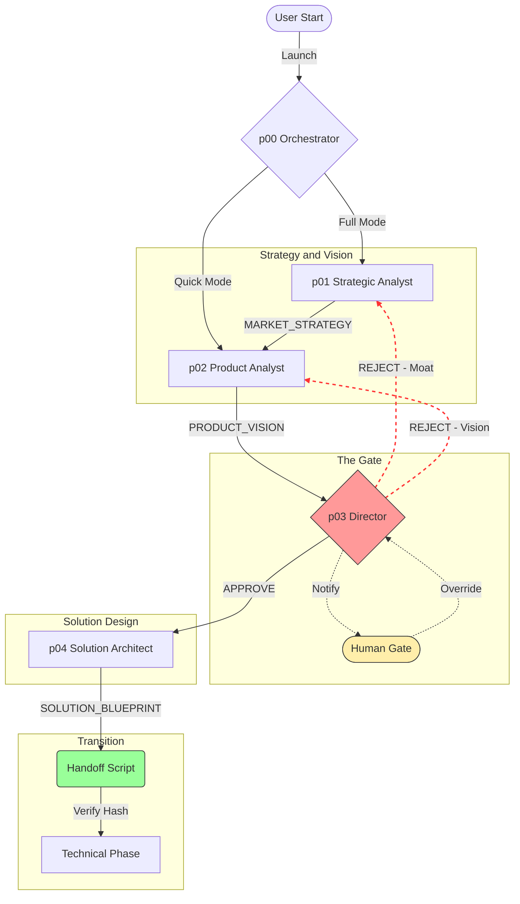

# Product Development Vision v3.2 (Comprehensive Restoration)

> **Status:** Final Blueprint (Ready for Implementation)
> **Created:** 2026-01-24
> **Previous Versions:** v1, v2, v3, v3.1, v3.2
> **Purpose:** Blueprint for the "Venture Builder" extension to Agentic Development.

---

## Table of Contents
- [Executive Summary](#executive-summary)
- [Visual Architecture](#visual-architecture)
  - [The "Product Discovery" Pipeline](#the-product-discovery-pipeline)
- [Evolution to v3](#evolution-to-v3)
- [Core Architecture](#core-architecture)
  - [The Pipeline Agents](#the-pipeline-agents)
  - [File Structure & Isolation](#file-structure--isolation)
- [Detailed Agent Definitions (The "Lean Five")](#detailed-agent-definitions-the-lean-five)
  - [p00_product_orchestrator](#p00_product_orchestrator)
  - [p01_strategic_analyst](#p01_strategic_analyst)
  - [p02_product_analyst](#p02_product_analyst)
  - [p03_product_director (The Gatekeeper)](#p03_product_director-the-gatekeeper)
  - [p04_solution_architect](#p04_solution_architect)
- [Flexibility: Workflows](#flexibility-workflows)
  - [1. /product-full-discovery (Default for Enterprise)](#1-product-full-discovery-default-for-enterprise)
  - [2. /product-quick-vision (Internal Tools / Hackathons)](#2-product-quick-vision-internal-tools--hackathons)
  - [3. /product-market-only (Idea Validation)](#3-product-market-only-idea-validation)
- [Handoff Mechanism (The Bridge & BRD Compiler)](#handoff-mechanism-the-bridge--brd-compiler)
- [Risks, Mitigations & VDD](#risks-mitigations--vdd)
- [Implementation Plan](#implementation-plan)
  - [Prerequisite: Strict Skill Creation](#prerequisite-strict-skill-creation)
  - [Phase 1: Migration & Foundation (Week 1)](#phase-1-migration--foundation-week-1)
  - [Phase 2: Skill Upgrades (Week 1-2)](#phase-2-skill-upgrades-week-1-2)
  - [Phase 3: The Handoff (Week 2)](#phase-3-the-handoff-week-2)
- [How to Start (User Experience)](#how-to-start-user-experience)
- [Appendix: Example Artifact Run (FlexArb Bots)](#appendix-example-artifact-run-flexarb-bots)
  - [docs/product/MARKET_STRATEGY.md](#docsproductmarket_strategymd)
  - [docs/product/PRODUCT_VISION.md](#docsproductproduct_visionmd)
  - [docs/product/SOLUTION_BLUEPRINT.md (Snippet)](#docsproductsolution_blueprintmd-snippet)
  - [docs/product/APPROVED_BACKLOG.md (Footer)](#docsproductapproved_backlogmd-footer)
- [Conclusion & Success Metrics](#conclusion--success-metrics)
- [Appendix: BRD Structure (Generated)](#appendix-brd-structure-generated)

---

## Executive Summary

We are expanding Agentic Development from a "Code Generator" to a **"Full-Cycle Venture Builder"**. This expansion adds a dedicated **Product Discovery Phase** that operates strict *Air Gaps* and *Quality Gates* before any technical planning occurs.

**Our Moat:** Unlike standard coding tools that rush to build "technically correct garbage," this framework forces business viability validation first. We don't just write code; we ensure the *business logic* is sound, defensible, and profitable before the first line of code is written. **This makes Agentic Development the only framework that actively fights against building the wrong product.**

---

## Visual Architecture

### The "Product Discovery" Pipeline

The flow is sequential, strictly gated, and human-supervised.



---

## Evolution to v3

| Aspect | Phase 0 (Bootstrap) | v3 (Final Target) |
|--------|----------------------|-------------------|
| **Agent Count** | 2 | **5 (Lean & Focused)** |
| **Logic** | Simple Loop | **Consolidated Pipeline** |
| **Flexibility** | Rigid | **Multi-Mode (Quick/Full/Audit)** |
| **Risk Reduction** | Low (Idea Validation) | **Maximum (80% less chance of failure)** |

---

## Core Architecture

### The Pipeline Agents

| Seq | Agent | Role | Output Artifacts | Check / Gate | Optional? |
|-----|-------|------|------------------|--------------|-----------|
| 0 | **p00** | **Product Orchestrator** | *Coordination* | "What mode are we in?" | No |
| 1 | **p01** | **Strategic Analyst** | `MARKET_STRATEGY.md` | "Market Size deflated? Comp Moat real?" | Yes (Quick Mode) |
| 2 | **p02** | **Product Analyst** | `PRODUCT_VISION.md` | "Does Value Prop match Strategy?" | No |
| 3 | **p03** | **Product Director** | *Review Comments* | **CRITICAL GATE (Adversarial VDD)** | No |
| 4 | **p04** | **Solution Architect** | `SOLUTION_BLUEPRINT.md` | "Is UX/ROI feasible?" | Yes (Vision Mode) |
| 5 | **Handoff** | *Scripted Gate* | `docs/TASK.md` + `docs/BRD.md` | "Approved by p03?" | No |

### File Structure & Isolation

We adopt a **Hybrid Isolation** strategy. To avoid breaking existing technical workflows, we keep technical artifacts in `docs/` but strictly isolate product work in `docs/product/`. **Technical artifacts remain in root docs/ for backward compatibility with existing workflows.**

```text
project-root/
├── docs/
│   ├── product/                  # 🟢 PRODUCT PHASE (Owned by p00-p04)
│   │   ├── MARKET_STRATEGY.md
│   │   ├── PRODUCT_VISION.md
│   │   ├── SOLUTION_BLUEPRINT.md
│   │   └── APPROVED_BACKLOG.md
│   │
│   ├── TASK.md                   # 🔵 TECHNICAL PHASE (Root of Technical)
│   ├── ARCHITECTURE.md           #    (Stays in docs/ to avoid breaking refs)
│   └── PLAN.md
```

---

## Detailed Agent Definitions (The "Lean Five")

### p00_product_orchestrator
**Role:** The Controller. Entry point for the user.
- **Tools:** `list_dir`, `read_file`, `write_to_file`.
- **Logic:** Does not write strategy. Only dispatches. Determines the workflow (`Full`, `Quick`, `Market-Only`).

### p01_strategic_analyst
**Role:** The Researcher.
- **Context:** Merges "Market" and "Competition".
- **Rule:** "Cite sources or state 'Conservative Estimate 2026' for all data."
- **Focus:** Statistics, Growth Trends, User Pain Points (Macro level).

### p02_product_analyst
**Role:** The Visionary.
- **Focus:** Synthesis. Takes the raw *Strategy* and shapes it into a *Product Vision*.
- **Tools:** Uses `skill-product-vision-canvas` (Crossing the Chasm, Emotional logic).

### p03_product_director (The Gatekeeper)
**Role:** The Adversarial Critic (VC Proxy).
- **Behavior:** Operates in strict **VDD Mode**. "Challenge every claim with counter-evidence."
- **Voice Examples:**
    - *"This moat is an illusion — Bybit will launch this feature natively by Q3 2026."*
    - *"Your viral coefficient assumption of 1.5 is hallucinated; real average for this sector is 0.2."*
    - *"Your TAM of $50B is inflated — conservative 2026 estimate is $15-20B based on regulatory slowdown."*
- **Powers:** Can **BLOCK** the handoff by refusing to generate the Approval Hash.

### p04_solution_architect
**Role:** The Pragmatist.
- **Combines:** Business Case (Money) and UX/Scope (Feasibility).
- **Constraint:** **Text-based wireframes ONLY.** No code generation.
- **Mandate:** Must include sections ready for BRD compilation:
    -   **User Requirements:** Personas, User Stories (INVEST), Text Flows.
    -   **NFRs:** Security, Scalability, Performance constraints.
    -   **Roadmap Basics:** MVP Scope + future milestones.
    -   **Risk Register:** Top 5 risks + mitigations.
    -   **Business Case:** ROI, Cost/Benefit analysis.
    -   Note: All sections must be BRD-ready (numbered for compilation)
- **Output:** Defines the *Shape* of the MVP so Developers know *what* to build, not *how*.

---

## Flexibility: Workflows

### 1. `/product-full-discovery` (Default for Enterprise)
`p00` -> `p01 (Strategy)` -> `p02 (Vision)` -> `p03 (Review)` -> `p04 (Solution)` -> `Handoff`.
*Used for: New Enterprise Products, Startups, Complex Modules.*

### 2. `/product-quick-vision` (Internal Tools / Hackathons)
`p00` -> `p02 (Vision)` -> `p03 (Review)` -> `Handoff`.
*Skips Market/Comp research. Assumes problem is known.*

### 3. `/product-market-only` (Idea Validation)
`p00` -> `p01 (Strategy)`.
*Stops there. Output is a research report. Useful for checking "Should we even do this?".*

---

## Handoff Mechanism (The Bridge & BRD Compiler)

The `handoff_to_technical.py` script is the **only bridge**.

1.  **Strict Gate:** Checks `docs/product/APPROVED_BACKLOG.md` for a specific Approval Hash.
    -   **Hash Format:** `APPROVAL_HASH: $(python -c 'import uuid; print(uuid.uuid4())')-$(date +%s)-APPROVED`
    -   *Note:* Only `p03` is authorized to generate this line, Script executes this command if needed for reproducibility
    -   *Benefit:* Ensures no unauthorized handoffs.
2.  **BRD Compilation (New):**
    -   The script *automatically compiles* `docs/BRD.md` (Business Requirements Document) by merging:
        -   `MARKET_STRATEGY.md` -> Sections: Problem, Market, Competition.
        -   `PRODUCT_VISION.md` -> Sections: Business Overview, Goals, Product Desc.
        -   `SOLUTION_BLUEPRINT.md` -> Sections: UX, Biz Model, Roadmap, Risks, NFRs.
    -   *Benefit:* Creates a single source of truth for Legal/Compliance/Investors without extra work.
3.  **Synthesis Trigger:** The script writes `TASK.md` to `docs/` and outputs a completion message.

---

## Risks, Mitigations & VDD

| Risk | Mitigation Strategy |
|------|---------------------|
| **Hallucinations** (Fake Data) | **Human-in-Loop Rule:** `p01` must flag assumptions. `p03` specifically challenges stats. |
| **Token Budget Explosion** | **Consolidation:** 5 agents. Max 2k tokens/agent. Shared context files. |
| **Process Overhead** | **Default to Quick Mode:** Only use Full Discovery for external/high-risk products. |
| **"Zombie" Backlogs** | **Expiration:** Research older than 1 month is flagged as "Needs Re-verify". |
| **Human Override Abuse** | **Audit Log:** Log all overrides in `APPROVED_BACKLOG.md` for audit. |
| **BRD Inaccuracies** | Mitigation: Human review of compiled BRD.md before sharing externally. |

---

## Implementation Plan

We will migrate the Phase 0 (Bootstrap) assets to the v3 Architecture.

### Prerequisite: Strict Skill Creation
> [!IMPORTANT]
> **ALL** skill updates and creations MUST be done using the **`skill-creator`** skill.
> Manual editing of `SKILL.md` is FORBIDDEN.
>
> **Procedure:**
> 1. Load `skill-creator`.
> 2. Read `skill-creator/SKILL.md`.
> 3. Use the templates provided to generate the new skill structure.

### Phase 1: Migration & Foundation (Week 1)
**Goal:** Establish the v3 structure and migrate existing agents.

1.  **Structure Setup:**
    -   Create `docs/product/`.
    -   *Note:* standard `docs/` remains the home for Technical Artifacts (No migration needed for existing files).

2.  **Agent Migration:**
    -   **p01 (Old) -> p02 (New):**
        -   *Action:* Rename current `p01_product_analyst` to `p02_product_analyst`.
        -   *Update:* Refine prompt to focus *only* on Vision Synthesis (remove market research responsibilities).
    -   **p02 (Old) -> p03 (New):**
        -   *Action:* Rename current `p02_product_reviewer` to `p03_product_director`.
        -   *Update:* Add "Adversarial VDD" persona and "Approval Hash" logic.

3.  **New Agent Creation:**
    -   Create `p00_product_orchestrator` (Logic Controller).
    -   Create `p01_strategic_analyst` (Market/Comp Research).
    -   Create `p04_solution_architect` (Biz/UX).

### Phase 2: Skill Upgrades (Week 1-2)
**Goal:** Equip agents with TIER 2 skills.

1.  **`skill-product-analysis` (Upgrade):**
    -   *Use skill-creator:* Update to include "Crossing the Chasm" and "Emotional Logic" templates.
    -   *Assign to:* `p02_product_analyst`.
    -   *Requirement:* Must follow TIER 2 isolation.

2.  **`skill-strategic-analysis` (New):**
    -   *Use skill-creator:* Create new skill for TAM/SAM/SOM and Competitive Matrices.
    -   *Assign to:* `p01_strategic_analyst`.

3.  **`skill-solution-blueprint` (New):**
    -   *Use skill-creator:* Create new skill for ROI calculation and Text-UX flow syntax.
    -   *Assign to:* `p04_solution_architect`.

### Phase 3: The Handoff (Week 2)
**Goal:** Build the automated bridge.

1.  **Script:** `handoff_to_technical.py`.
    -   Logic: Verify Hash -> Synthesize TASK.md -> Move Files -> Trigger 01.
    -   **Test:** Run verification on a "Dummy Idea" to ensure the gate holds.
2. Implement BRD compilation logic in handoff script.
---

## How to Start (User Experience)

The Product Phase is triggered intentionally.

```markdown
## Launching Product Discovery
To start, use this template prompt:

> "Launch Product Discovery for [Idea Name]. Mode: [Full / Quick / Market-Only]."

This triggers `p00_orchestrator` which will:
1. Verify the mode.
2. Create/Clear `docs/product/`.
3. Dispatch `p01` or `p02`.
```

---

## Appendix: Example Artifact Run (FlexArb Bots)

*Synthesized example of what the new artifacts look like.*

### `docs/product/MARKET_STRATEGY.md`
> **Market:** Crypto Arbitrage Bots. **TAM:** $50B (2025).
> **Competitors:** Veles (No AI), 3Commas (Security Issues).
> **Gap:** "Institutional-grade security for retail subaccounts."
> **Risk:** Exchange API limits tightening in 2026.

### `docs/product/PRODUCT_VISION.md`
> **Vision:** "For semi-pro traders who fear API hacks, FlexArb is a non-custodial vault that trades safely."
> **Differentiation:** Zero-Knowledge Execution (unlike 3Commas).

### `docs/product/SOLUTION_BLUEPRINT.md` (Snippet)
```markdown
## UX Flow: Subaccount Binding
1. User clicks "Connect Exchange".
2. System requests "Read-Only API Key".
3. **Critical:** Key is encrypted client-side before transmission.
4. User sets "Max Daily Risk" policy (Smart Contract signature).

## Unit Economics
- **CAC:** $50 (via Influencers).
- **LTV:** $600 (12 months retention).
- **Verdict:** Positive (LTV/CAC > 10).
```

### `docs/product/APPROVED_BACKLOG.md` (Footer)
```text
...
## Final Approval
- Status: APPROVED
- Reviewer: p03_product_director
- APPROVAL_HASH: 550e8400-e29b-41d4-a716-446655440000-1735689600-APPROVED
```

---

## Conclusion & Success Metrics

This blueprint creates a rigorous "Venture Builder" inside your IDE.

**Success Metrics:**
- **Kill Rate:** >70% of ideas should be rejected or forced to pivot by `p03`. If everything passes, the filter is broken.
- **Handoff Quality:** 0 manual edits required in `TASK.md` after handoff. 100% BRD generation compliance.
- **BRD Usage:** >80% projects use generated BRD for stakeholders.

---

## Appendix: BRD Structure (Generated)

The `docs/BRD.md` will strictly follow this enterprise template (16 sections), populated from the sparse artifacts:

1.  **Title & Version Control** (Auto-generated)
2.  **Introduction** (Scope, Stakeholders)
3.  **Business Overview** (Mission, ROI link)
4.  **Problem & Market** (from *MARKET_STRATEGY*)
5.  **Goals & Objectives** (SMART goals from *VISION*)
6.  **Product Description** (Features, Stories form *VISION*)
7.  **UX Requirements** (Personas, Journeys from *BLUEPRINT*)
8.  **Technical Requirements** (Stack, Security from *BLUEPRINT NFRs*), TBD — will be refined in Technical Phase (Architect agent)
9.  **Business Model** (Monetization from *BLUEPRINT*)
10. **Competitive Analysis** (from *MARKET_STRATEGY*)
11. **Roadmap** (Milestones from *BLUEPRINT*)
12. **Financial Plan** (Projections from *BLUEPRINT*)
13. **Team & Resources** (Template/Placeholder), TBD — will be refined in Technical Phase (Architect agent)
14. **Risks & Assumptions** (from *BLUEPRINT*)
15. **Metrics** (KPIs from *VISION*)
16. **Appendices** (Links to original markdown files)
