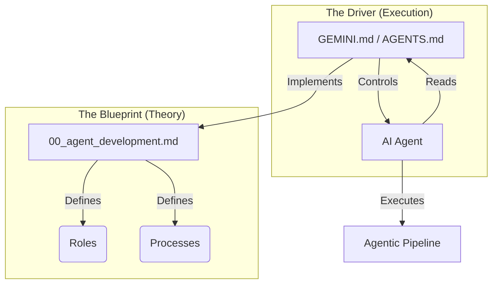

**🇺🇸 English** | [🇷🇺 Русский](README.ru.md)

> [!NOTE]
> This is the primary version. Translations may lag behind.

# Multi-Agent Software Development System v3.9.14

This framework orchestrates a multi-agent system for structured software development. It transforms vague requirements into high-quality code through a strict pipeline of specialized agents (Analyst, Architect, Planner, Developer, Reviewer, Security Auditor).

The methodology combines two key approaches (see [Comparison](System/Docs/TDD_VS_VDD.md)):
- **TDD (Test-Driven Development)**: The "Stub-First" strategy ensures that tests are written and verified against stubs before actual implementation begins. [Read more](System/Docs/TDD.md).
- **VDD (Verification-Driven Development)**: A high-integrity mode where an adversarial agent proactively challenges the plan and code to eliminate hallucinations and logic errors before they are committed. [Read more](System/Docs/VDD.md).


## 📋 Table of Contents
- [Installation & Setup](#-installation--setup)
  - [1. Copy Framework Folders](#1-copy-framework-folders)
  - [2. Choose Your AI Assistant](#2-choose-your-ai-assistant)
  - [3. Installation Requirements (Python)](#3-installation-requirements-python)
- [System Overview](#-system-overview)
  - [Directory Structure](#directory-structure)
  - [Concept Deep Dive: Blueprint vs Driver](#-concept-deep-dive-blueprint-vs-driver)
  - [The Agent Team (Roles)](#-the-agent-team-roles)
  - [The Product Team (Roles)](#-the-product-team-roles)
  - [Skills System](#-skills-system)
- [Workspace Workflows](#-workspace-workflows)
  - [Quick Start](#quick-start)
  - [Variants](#variants)
- [How to Start Development](#-how-to-start-development-step-by-step-plan)
  - [Phase 0: Product Discovery](#phase-0-product-discovery-optional)
  - [Stages 1-5](#stage-1-pre-flight-check)
- [Practical Usage (Claude Code & Gemini)](#-practical-usage-claude-code--gemini)
- [Artifact Management](#-artifact-management)
- [What to do with .AGENTS.md files?](#-what-to-do-with-agentsmd-files)
- [How to prepare for future iterations?](#-how-to-prepare-for-future-iterations)
- [Reverse Engineering](#-reverse-engineering-if-documentation-is-outdated)
- [Starter Prompts](#-starter-prompt-templates)
- [Migration Guide](#-migration-from-older-versions)


## 📁 Installation & Setup

### 1. Copy Framework Folders

Copy these folders to your project root:

| Folder | Required | Description |
|--------|----------|-------------|
| `System/` | ✅ **Yes** | Agent Personas, Docs, and Tool Dispatcher |
| `.agent/` | ✅ **Yes** | Skills, Workflows, and Tool definitions |

```bash
# Installation
cp -r /path/to/framework/System ./
cp -r /path/to/framework/.agent ./
cp /path/to/framework/GEMINI.md ./ # (For Antigravity)
```

> [!NOTE]
> The Tool Execution Subsystem is included in `System/scripts/`:
> - `System/scripts/tool_runner.py` — Dispatcher (entry point)
> - `.agent/tools/` — Tool logic and schemas

### 2. Choose Your AI Assistant

#### 🔵 Option A: Cursor IDE
To configure Cursor for this workflow:
1.  **Context Rules**: Copy `AGENTS.md` to your project root.
2.  **Skills**: Create a symbolic link to enable native skill detection:
    ```bash
    ln -s .agent/skills .cursor/skills
    ```
    *   *Note:* This allows Cursor to index the skills while keeping `.agent/skills` as the single source of truth.

#### 🟣 Option B: Antigravity (Native)
Antigravity supports this architecture out-of-the-box:
1.  **Configuration**: Copy `GEMINI.md` to your project root (this is the system prompt).
2.  **Skills**: Ensure `.agent/skills/` directory exists. Antigravity automatically loads skills from here.
3.  **Workflows**: (Optional) Use `.agent/workflows/` for automated sequences.
4.  **Auto-Run Permissions**: To enable autonomous command execution, add the following to **Allow List Terminal Commands** in IDE Settings:
    ```text
    ls,cat,head,tail,find,grep,tree,wc,stat,file,du,df,git status,git log,git diff,git show,git branch,git remote,git tag,mv docs/TASK.md,mv docs/PLAN.md,mkdir -p docs,mkdir -p .agent,mkdir -p tests,python -m pytest,python3 -m pytest,npm test,npx jest,cargo test
    ```

#### 🟠 Option C: Claude Code (Native)
To use with Anthropic's `claude` CLI:
1.  **Configuration**: Create a dedicated `CLAUDE.md` adapted from `AGENTS.md` (do not use a raw symlink when `AGENTS.md` contains Cursor-specific rules like `.cursor/skills`).
2.  **Prompt Compatibility**: In `CLAUDE.md`, keep pipeline rules intact, but ensure skills path references resolve to `.agent/skills/`.
3.  **Skills**: Create a `.claude/skills` symlink (optional, for compatibility):
    ```bash
    mkdir -p .claude
    ln -s ../.agent/skills .claude/skills
    ```
4.  **Usage**: Run `claude` in the project root. `CLAUDE.md` will be loaded automatically.

#### 🟢 Option D: Gemini CLI
To use with Google's `gemini` CLI:
1.  **Configuration**: Ensure `GEMINI.md` is present in the project root.
2.  **Usage**: Run `gemini` commands. The tool will look for `GEMINI.md` as the system instruction.

#### ⚫ Option E: Codex (Native)
To use this framework in Codex:
1.  **Configuration**: Use a Codex-compatible `AGENTS.md`. If your current file is Cursor-specific, adapt it so runtime rules do not depend on `.cursor/*` paths.
2.  **Skills**: Keep project skills in `.agent/skills/` as the source of truth.
3.  **Optional Global Skills**: Reusable meta-skills can be installed to `$CODEX_HOME/skills` when you want cross-project reuse.
4.  **Usage**: Open the project in Codex and start tasks from the repository root context.

### 3. Installation Requirements (Python)
This framework requires a reproducible Python environment for tool execution, validators, and test automation.

#### Supported Python
- **Required:** Python `3.11+` (recommended)
- **Minimum:** Python `3.9+` (legacy compatibility)

#### Virtual Environment (Mandatory)
```bash
python3 -m venv .venv
source .venv/bin/activate
python -m pip install --upgrade pip setuptools wheel
```

#### Install Dependencies (Pinned)
```bash
pip install -r requirements-dev.txt
# Optional integrations:
pip install openai python-dotenv
```

#### Smoke Check (Must Pass)
```bash
python --version
python -m pytest --version
python -c "import yaml; print('pyyaml: ok')"
python .agent/skills/skill-creator/scripts/init_skill.py --help
python .agent/skills/skill-creator/scripts/validate_skill.py .agent/skills/skill-creator
python System/scripts/doctor.py
```

#### Troubleshooting
- `No module named pytest`
  - Run: `pip install -r requirements-dev.txt`
- `No module named yaml`
  - Run: `pip install -r requirements-dev.txt`
- If global Python conflicts occur:
  - Deactivate and recreate `.venv`, then reinstall only required packages.

> [!IMPORTANT]
> Do not install dependencies globally. Use `.venv` for all framework tooling.

---

## 🏗 System Overview

### Directory Structure
```text
project-root/
├── AGENTS.md                    # [Cursor] Context & Rules
├── GEMINI.md                    # [Antigravity] System Config
├── .agent/
│   ├── skills/                  # [Common] Skill Catalog
│   │   ├── ...
│   │   └── skill-product-*      # [Product] Strategy, Vision, Handoff
│   ├── workflows/               # [Common] Workflow Library
│   └── tools/                   # [Common] Tool Logic & Schemas
├── System/
│   ├── Agents/                  # [Common] Agent Personas (00-10, p00-p04)
│   ├── Docs/                    # [Common] Framework Documentation
│   └── scripts/                 # [Common] Tool Dispatcher
│       └── tool_runner.py
└── src/                           # Your Source Code
```

### 🔑 Concept Deep Dive: Blueprint vs Driver

To understand how the system works, it is crucial to distinguish between the **Documentation** and the **System Prompt**.

#### 1. The Blueprint (`System/Agents/00_agent_development.md`)
This file is the **Constitutional Document** of the system.
- **Role**: Describes "What the system is" and "How it is composed".
- **Content**: Role definitions (Analyst, Architect, etc.), Skill Tiers, Task Boundary logic, and specific rules for artifacts (TASK.md, ARCHITECTURE.md).
- **Usage**: Source of Truth for humans and for agents needing to understand the "Theory" of the framework.

#### 2. The Driver (`GEMINI.md` / `AGENTS.md`)
This file is the **Executable System Instruction** for the AI Agent.
- **Role**: Tells the agent "What to do RIGHT NOW" and "How to execute the rules".
- **Content**: Imperative commands (MUST, CRITICAL), the Execution Pipeline (Analysis -> Architecture -> ...), and Protocol definitions.
- **Usage**: The active prompt that "programs" the agent's behavior.

#### Visualization



#### Comparison

| Feature | `00_agent_development.md` | `GEMINI.md` / `AGENTS.md` |
| :--- | :--- | :--- |
| **Type** | Documentation / Specification | Prompt / Instruction |
| **Style** | Descriptive ("System consists of...") | Imperative ("You MUST do...") |
| **Goal** | Explain system structure | Control agent behavior |
| **Target** | Developer & Agents (Context) | AI Model (System Prompt) |
| **Analogy** | Constitution / Bylaws | Job Description / Algorithm |

> **Relationship**: `GEMINI.md` enforces what is described in `00_agent_development.md`. Without the first, the agent wouldn't know the big picture. Without the second, the agent would know the theory but lack the strict algorithm to execute user tasks.

### 🤖 The Agent Team (Roles)

| Role | File | Responsibility |
|------|------|----------------|
| **Orchestrator** | `01_orchestrator.md` | Project Manager. Dispatches tasks, manages the pipeline. |
| **Analyst** | `02_analyst_prompt.md` | Requirements elicitation, TASK creation. |
| **TASK Reviewer** | `03_task_reviewer_prompt.md` | Quality control for Technical Specifications. |
| **Architect** | `04_architect_prompt.md` | System design, database schema, API definition. |
| **Arch Reviewer** | `05_architecture_reviewer_prompt.md` | Validates verification of architectural decisions. |
| **Planner** | `06_planner_prompt.md` | Breaks down implementation into atomic steps (Stub-First). |
| **Plan Reviewer** | `07_plan_reviewer_prompt.md` | Ensures the plan is logical and testable. |
| **Developer** | `08_developer_prompt.md` | Writes code (Stubs -> Tests -> Implementation). |
| **Code Reviewer** | `09_code_reviewer_prompt.md` | Final code quality check. |
| **Security Auditor** | `10_security_auditor.md` | Security vulnerability assessment and reporting. |

### 🚀 The Product Team (Roles)

| Role | File | Responsibility |
|------|------|----------------|
| **Product Orch** | `p00_product_orchestrator_prompt.md` | Dispatches product tasks to Strategy/Vision/Director. |
| **Strategic Analyst** | `p01_strategic_analyst_prompt.md` | Market Research, TAM/SAM/SOM, Competitive Analysis. |
| **Product Analyst** | `p02_product_analyst_prompt.md` | Product Vision, User Stories, Backlog Prioritization (WSJF). |
| **Director** | `p03_product_director_prompt.md` | **Quality Gate**. Approves BRD with cryptographic hash. |
| **Solution Arch** | `p04_solution_architect_prompt.md` | Feasibility Check, ROI, Solution Blueprint. |

### 📊 How the System Prompt is Loaded

| Tool | System Prompt File | Loading Method |
|------|-------------------|----------------|
| **Cursor IDE** | `AGENTS.md` | Automatic (context rules) |
| **Antigravity** | `GEMINI.md` | Automatic (native) |
| **Claude Code** | `CLAUDE.md` (adapted from `AGENTS.md`) | Automatic (on launch) |
| **Codex** | `AGENTS.md` (Codex-compatible) | Automatic (workspace policy) |
| **Gemini CLI** | `GEMINI.md` | Automatic (system instruction) |

**Note:** See [Blueprint vs Driver](#-concept-deep-dive-blueprint-vs-driver) for the difference between `00_agent_development.md` (theory) and system prompt files (execution).


### 📚 Skills System
Version 3.0 introduces a modular **Skills System** that separates "Who" (Agent) from "What" (Capabilities).
- **Reduces Prompt Size**: Agents only load what they need.
- **Shared Logic**: Improvements in a skill benefit all agents.

**Structure:**
- `.agent/skills/` — Markdown instructions and templates.
- `.agent/tools/` — Native tool definitions and schemas.
- `System/scripts/` — Execution engine for tools.

**Capabilities**: Run tests, Git operations, File I/O, Archiving.

**[>> View Full Skills Catalog <<](System/Docs/SKILLS.md)**
**[>> Orchestrator & Tools Guide <<](System/Docs/ORCHESTRATOR.md)**
**[>> Source of Truth Map <<](System/Docs/SOURCE_OF_TRUTH.md)**
**[>> Release Checklist <<](System/Docs/RELEASE_CHECKLIST.md)**

By default, the system uses English prompts. To use **Russian** context:
1.  Copy content from `Translations/RU/Agents` to `System/Agents`.
2.  Copy content from `Translations/RU/Skills` to `.agent/skills`.

---

## ⚡ Workspace Workflows

To simplify launching different development modes, the project provides special **Workflows**.
Detailed description of all workflows: [WORKFLOWS](System/Docs/WORKFLOWS.md).

### Quick Start
You can run a workflow simply by asking the agent:
- Canonical command form is `run <workflow-name>`; slash form (`/workflow-name`) is an alias.


- **Product Discovery (New):**
  - "Start Product Discovery" -> runs `run product-full-discovery` (Full pipeline)
  - "Just the vision" -> runs `run product-quick-vision` (Fast track)
  - "Analyze market" -> runs `run product-market-only` (Strategy only)

- **Standard Mode (Stub-First):**
  - "Start feature X" -> runs `run 01-start-feature`
  - "Plan implementation" -> runs `run 02-plan-implementation`
  - "Develop task" -> runs `run 03-develop-single-task` (single) or `run 05-run-full-task` (loop)

- **VDD Mode (Verification-Driven Development):**
  - "Start feature X in VDD mode" -> runs `run vdd-01-start-feature`
  - "Develop task in VDD mode" -> runs `run vdd-03-develop` (Adversarial Loop)

### Variants
1. **Standard**: Basic mode, focused on speed and structure (Stub-First).
2. **VDD (Verification-Driven)**: High-reliability mode using an "Adversarial Agent" (Sarcasmotron) that harshly criticizes code.
3. **Nested & Advanced**:
   - **VDD Enhanced** (`run vdd-enhanced`; alias: `/vdd-enhanced`): Runs Stub-First then VDD Refinement.
   - **VDD Multi-Adversarial** (`run vdd-multi`; alias: `/vdd-multi`): Sequential 3-critic verification (Logic → Security → Performance).
   - **Full Robust** (`run full-robust`; alias: `/full-robust`): Runs VDD Enhanced then Security Audit.

---

## 🚀 How to Start Development (Step-by-Step Plan)

This process will take you from an idea to finished code in the repository.

### Phase 0: Product Discovery (Optional)
**Agents `p00`-`p04`** ensure you are building the *right* product before you build it *right*.

1. **Orchestrator (p00):** Decides if you need "Market Research" or just a "Quick Vision".
2. **Strategy (p01):** Calculates TAM/SAM/SOM and checks competitors.
3. **Vision (p02):** Defines the "Soul" of the product and User Stories.
4. **Director (p03):** **Adversarial Gatekeeper**. Rejects fluff. Signs off with a cryptographic hash.
5. **Solution (p04):** Converts Vision to `SOLUTION_BLUEPRINT.md` (ROI, UX Flows).
6. **Handoff:** Compiles `BRD.md` and triggers the Technical Phase.

**[>> Read the full Product Development Playbook <<](System/Docs/PRODUCT_DEVELOPMENT.md)**

### Stage 1: Pre-flight Check
1. **Initialization:** Ensure you are in the project root.
2. **Reconnaissance:** If the project already exists, ensure `.AGENTS.md` files exist in root folders. If not, create empty or basic ones so agents have somewhere to write.

### Stage 2: Analysis and Design
1. **Analyst (02_analyst_prompt.md):**
   - Provide the agent with the idea/task.
   - The agent studies the project structure (Reconnaissance).
   - Result: **Technical Specification (TASK)**.
2. **TASK Review (03_task_reviewer_prompt.md):**
   - Check the TASK for completeness and consistency.
3. **Architect (04_architect_prompt.md):**
   - Based on the TASK, the agent designs the architecture.
   - Result: **Architecture Document** (`docs/ARCHITECTURE.md`) - (classes, databases, APIs).
4. **Architecture Review (05_architecture_reviewer_prompt.md):**
   - Approve the architecture before planning.

### Stage 3: Planning (Stub-First)
1. **Planner (06_planner_prompt.md):**
   - The agent creates a work plan.
   - **IMPORTANT:** The plan must follow the **Stub-First** strategy:
     - Task X.1 [STUB]: Create structure and stubs + E2E test on hardcode.
     - Task X.2 [IMPL]: Implement logic + update tests.
2. **Plan Review (07_plan_reviewer_prompt.md):**
   - Check that Stub-First principle is observed. If not, send for revision.

### Stage 4: Development (Implementation Cycle)
For each pair of tasks in the plan (Stub -> Impl):

1. **Developer (08_developer_prompt.md) — STUB Phase:**
   - Creates files, classes, and methods.
   - Methods return `None` or hardcode (e.g., `return True`).
   - Writes an E2E test that passes on this hardcode.
   - **Documentation First:** Creates/updates `.AGENTS.md` in affected folders.
2. **Code Review (09_code_reviewer_prompt.md) — STUB Phase:**
   - Checks: "Are these really stubs? Does the test pass?".
3. **Developer (08_developer_prompt.md) — IMPLEMENTATION Phase:**
   - Replaces hardcode with real logic.
   - Updates tests (removes hardcode asserts, adds real checks).
   - **Anti-Loop:** If tests fail 2 times in a row with the same error — stop and analyze.
4. **Code Review (09_code_reviewer_prompt.md) — IMPLEMENTATION Phase:**
   - Checks: "No stubs left? Is code clean? Do tests pass?".

### Stage 5: Completion and Commit
1. **Final Check:** Run the full test suite (Regression Testing).
2. **Git Commit:**
   - If all tests are green, make a commit.
   - Recommended format: `feat(scope): description`.
3. **Artifacts:**
   - Ensure all created artifacts (TASK, Architecture, Plan) are saved in the project documentation.
   - **Archive TASK:** Copy the final Technical Specification to the archive: `cp docs/TASK.md docs/tasks/task-ID-name.md`.

---


<a id="practical-usage"></a>
## 🕹️ Practical Usage (Claude Code & Gemini)

### Scenario 1: Standard Development (Full Pipeline)

```bash
cd my-project
claude
# or gemini
```

**Prompt:**
```text
Develop a "Payment Gateway" module.
Requirements:
- Stripe API integration
- Webhook handling
- Database transaction logging
```

**Automated Process:**
1.  **Analysis**: Agent reads `02_analyst_prompt.md`, creates `TASK.md`.
2.  **Architecture**: Agent reads `04_architect_prompt.md`, updates `ARCHITECTURE.md`.
3.  **Planning**: Agent reads `06_planner_prompt.md`, creates `PLAN.md` (Stub-First).
4.  **Development**: Agent reads `08_developer_prompt.md`, implements Stubs -> Tests -> Code.

**Result**: You get a fully implemented, tested feature with documentation without manual intervention.

---

### Scenario 2: Light Mode (Fast-Track)

For simple tasks (typos, UI tweaks), use the `/light` workflow to skip heavy planning.

**Prompt:**
```text
/light
Fix the typo in the Submit button: "Sumbit" -> "Submit"
```

**Automated Process:**
1.  **Recognition**: Agent detects `[LIGHT]` mode.
2.  **Execution**: Skips Architecture/Planning.
3.  **Action**: Directly modifies the code and runs a quick verification.

---

### Scenario 3: Session Restoration

If you interrupt the session, you can resume exactly where you left off.

**Prompt:**
```text
Resume work on the Email Notifications task.
```

**Automated Process:**
1.  **Read State**: Agent reads `.agent/sessions/latest.yaml`.
2.  **Restore Context**: "AH, we were in Development Phase, Task 2.1 [STUB]".
3.  **Continue**: Resumes execution without re-analyzing the whole project.

---

<a id="artifact-management"></a>
## 🗂 Artifact Management

During the development process, agents create various artifacts. Here is how to handle them:

| Artifact | Path | Status | Recommendation |
|----------|------|--------|----------------|
| **Product Strategy** | `docs/product/MARKET_STRATEGY.md` | **Strategic** | TAM/SAM/SOM & Competitive Analysis. Update quarterly. |
| **Product Vision** | `docs/product/PRODUCT_VISION.md` | **Strategic** | "North Star". Defines User Stories and Values. |
| **Solution Blueprint** | `docs/product/SOLUTION_BLUEPRINT.md` | **Tactical** | ROI, Risk Register, UX Flows. |
| **BRD** | `docs/product/BRD.md` | **Quality Gate** | Business Requirements. Signed with hash. Triggers dev. |
| **Technical Specification** | `docs/TASK.md` | **Single Source of Truth (Technical)** | **STRICTLY for current active task**. Derived from BRD. |
| **Architecture** | `docs/ARCHITECTURE.md` | **Source of Truth (System)** | **NEVER DELETE**. Keep updated. This is the map of your system. |
| **Known Issues** | `docs/KNOWN_ISSUES.md` | **Living Document** | Keep. Document bugs, workarounds, and complex logic explanation. |
| **Task Archive** | `docs/tasks/task-ID-name.md` | **History / Immutable** | **Mandatory Archive**. All completed TASKs move here. Never edit after archiving. |
| **Subtask Description** | `docs/tasks/task-ID-SubID-slug.md` | **Granular Plan** | Created by Planner. detailed steps for Developer. |
| **Implementation Plan** | `docs/PLAN.md` (or `implementation_plan.md`) | **Transient** | Can be kept for history or deleted after task completion. |
| **Test Report** | `tests/tests-{TaskID}/...` | **Proof of Quality** | Created by Developer. Contains verification results. |
| **Walkthrough** | `walkthrough.md` | **Proof of Work** | Created after verification. Demonstrates changes and validation results. |
| **Task Checklist** | `task.md` | **Transient** | Task tracking. Reset/overwrite for new tasks. |
| **Agent Memory** | `.AGENTS.md` | **Long-term Memory** | **NEVER DELETE**. Commit to Git. |
| **Open Questions** | `docs/open_questions.md` | **Unresolved Issues** | Track unresolved architectural questions here. |

**Strict Artefact Rules (New v2.1):**
1. **One Task = One TASK**: `docs/TASK.md` always reflects *only* what is being built right now.
2. **Archive Strategy**:
   - **Before** starting a fundamentally new task: Archive `docs/TASK.md` -> `docs/tasks/task-00N-name.md`.
   - **During** the task: Only overwrite `docs/TASK.md`. Never append.
3. **Cleanup**:
   - **Keep**: All `docs/*` files that describe the *current* state of the system.
   - **Cleanup**: Intermediate scratchpads if you used them outside of `docs/`.

---

<a id="agents-files"></a>
## 📂 What to do with `.AGENTS.md` files?

**DO NOT DELETE THEM!**

The `.AGENTS.md` files are the project's "long-term memory" for agents (and humans).
- **When development is complete:** Leave them in the repository. They should be committed along with the code.
- **Why they are needed:** When you return to the project in a month (or another agent comes), this file explains: "This folder is responsible for auth, main files here are X and Y".
- **Maintenance:** If you refactor code manually, do not forget to update `.AGENTS.md`.

---

<a id="future-iterations"></a>
## 🔄 How to prepare for future iterations?

To make the next iteration go smoothly:
1. **Green Tests:** Leave the project with passing tests. A broken test at the start of the next task will confuse agents.
2. **Actual Map:** Check that `.AGENTS.md` matches reality.
3. **Open Questions:** If unresolved architectural questions remain, record them in `docs/open_questions.md` so the Architect of the next iteration sees them.

---

<a id="reverse-engineering"></a>
## 🛠 Reverse Engineering (If documentation is outdated)

If the user made "free-form" fixes during development completion, the documentation (e.g., `docs/TASK.md`, `docs/ARCHITECTURE.md`) might have desynchronized with the actual code.

To prevent AI from breaking what you fixed when adding a feature next time, you need to update the documentation.

> [!TIP]
> Use `skill-reverse-engineering` for structured recovery of architecture docs from code.
> Use `skill-update-memory` for automatic `.AGENTS.md` updates based on git diff.

**Example prompt (Reverse Engineering):**

```text
@docs/ARCHITECTURE.md

You are an Architect and Technical Writer.
Apply skill-reverse-engineering.

SITUATION:
We completed active development. Many manual fixes were made.
Current documentation is outdated and does not reflect the actual code structure.

TASK:
1. Use the iterative analysis strategy from skill-reverse-engineering.
2. Update docs/ARCHITECTURE.md with the real technical solution.
3. Record hidden knowledge in docs/KNOWN_ISSUES.md (TODOs, HACKs, complex spots).
4. Generate missing .AGENTS.md files using skill-update-memory format.
```


---

<a id="starter-prompts"></a>
## 📝 Starter Prompt Templates

**IMPORTANT:** To launch the process, use **Composer** (Cmd+I) or chat.
Copy this text to activate the Orchestrator via `AGENTS.md`.

### Template 1: Developing a New Feature (Feature)
```text
You are an Orchestrator.
Context: Our project - [PROJECT_NAME/DESCRIPTION].
TASK: Develop "[FEATURE_NAME]" module.
INPUT:
- [REQUIREMENT_1]
- [REQUIREMENT_2]
ACTION:
- Execute workflow `/base-stub-first` (Standard Pipeline).
```

### Template 2: Refactoring
```text
You are an Orchestrator.
TASK: Refactor "[MODULE_NAME]" module.
CONTEXT:
- Current code: `[PATH/TO/CODE]`.
- Problem: [DESCRIPTION_OF_PROBLEM].
- Goal: [DESCRIPTION_OF_GOAL].
ACTION:
- Execute workflow `/base-stub-first` (Analysis -> Arch -> Plan -> Refactor).
```

### Template 3: Complex Bugfix
```text
You are an Orchestrator.
TASK: Fix the "[ERROR_DESCRIPTION]" bug.
INPUT:
- Log file: [PATH_TO_LOGS].
ACTION:
- Execute workflow `/vdd-adversarial` to reproduce and fix.
```

### Template 4: Documentation Restore (Reverse Engineering)
```text
You are an Orchestrator.
TASK: Restore outdated documentation.
CONTEXT:
- Active development finished, but `docs/` are stale.
ACTION:
- Execute workflow `/04-update-docs` to reverse-engineer architecture and update memory.
```

### Template 5: Security Audit
```text
You are an Orchestrator.
TASK: Audit the "[MODULE_OR_SERVICE_NAME]" for vulnerabilities.
ACTION:
- Execute workflow `/security-audit`.
```

---

<a id="migration-guide"></a>
## 🔄 Migration from Older Versions

### Upgrading to v3.1.0 (Global Refactor)
**Goal:** Transition from "TZ" (Техническое Задание) to "TASK" to align with the new standard.

1. **Rename Artifact:**
   ```bash
   mv docs/TZ.md docs/TASK.md
   ```
2. **Update Prompts:**
   - Overwrite `System/Agents/` with the latest version from v3.1.0 release.
   - Key shift: `03_tz_reviewer_prompt.md` is now **`03_task_reviewer_prompt.md`**.
3. **Update Skills:**
   - Overwrite `.agent/skills/` with the latest version.

### Upgrading to v3.0.0 (Skills System)
**Goal:** Enable modular agents.

1. **Delete Legacy:** Remove `System/Agents` (if it contains monolithic prompts).
2. **Install New:** Copy `System/Agents` (v3.0+) and `.agent/` folder to root.
3. **Config:** Ensure `GEMINI.md` or `AGENTS.md` are updated.

---

