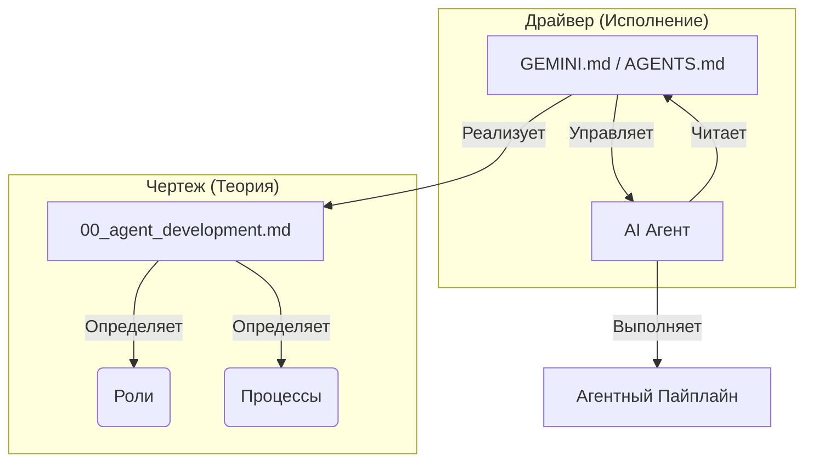

[🇺🇸 English](README.md) | **🇷🇺 Русский**

> [!NOTE]
> Английская версия является основной. Перевод может отставать.

# Мультиагентная система разработки v3.9.14

Это руководство описывает работу мультиагентной системы для разработки программного обеспечения. Система построена на конвейерном принципе, где каждый агент (Аналитик, Архитектор, Планировщик, Разработчик, Ревьюер, Аудитор Безопасности) выполняет свою специализированную роль для преобразования требований в качественный код.

Методология объединяет два ключевых подхода (см. [Сравнение](System/Docs/TDD_VS_VDD.md)):
- **TDD (Test-Driven Development)**: Использование стратегии "Stub-First" (сначала заглушки) гарантирует, что тесты пишутся и проверяются до начала реализации основной логики. [Подробнее](System/Docs/TDD.md).
- **VDD (Verification-Driven Development)**: Режим повышенной надежности, использующий состязательную проверку ("Adversarial Review") для раннего выявления логических ошибок и противоречий в плане реализации. [Подробнее](System/Docs/VDD.md).


## 📋 Оглавление
- [Установка и Настройка](#-установка-и-настройка-installation--setup)
  - [1. Скопируйте папки фреймворка](#1-скопируйте-папки-фреймворка)
  - [2. Выберите вашего AI-ассистента](#2-выберите-вашего-ai-ассистента)
  - [3. Требования к установке (Python)](#3-требования-к-установке-python)
- [Обзор Системы](#-обзор-системы-system-overview)
  - [Структура Директорий](#структура-директорий)
  - [Глубокое погружение: Чертеж против Драйвера](#-глубокое-погружение-чертеж-против-драйвера-blueprint-vs-driver)
  - [Команда Агентов (Роли)](#-команда-агентов-роли)
  - [Продуктовая Команда (Роли)](#продуктовая-команда-роли)
  - [Система Навыков](#-система-навыков-skills-system)
- [Workspace Workflows](#-workspace-workflows)
  - [Быстрый старт](#быстрый-старт)
  - [Варианты](#варианты-variants)
- [Как начать разработку](#-как-начать-разработку-пошаговый-план)
  - [Фаза 0: Product Discovery](#фаза-0-product-discovery-опционально)
  - [Этапы 1-5](#этап-1-подготовка-к-началу-разработки)
- [Практическое использование (Claude Code & Gemini)](#-практическое-использование-claude-code--gemini)
- [Управление артефактами](#-управление-артефактами-artifact-management)
- [Что делать с файлами .AGENTS.md?](#-что-делать-с-файлами-agentsmd)
- [Подготовка к итерациям](#-как-подготовиться-к-следующим-доработкам)
- [Reverse Engineering](#-reverse-engineering-если-документация-устарела)
- [Шаблоны промптов](#-шаблоны-стартовых-промптов-starter-prompts)
- [Миграция со старых версий](#-миграция-со-старых-версий)


## 📁 Установка и Настройка (Installation & Setup)

### 1. Скопируйте папки фреймворка

Скопируйте эти папки в корень вашего проекта:

| Папка | Обязательно | Описание |
|-------|-------------|----------|
| `System/` | ✅ **Да** | Персоны агентов, документация и диспатчер |
| `.agent/` | ✅ **Да** | Навыки, сценарии и определения инструментов |

```bash
# Установка
cp -r /path/to/framework/System ./
cp -r /path/to/framework/.agent ./
cp /path/to/framework/GEMINI.md ./ # (Для Antigravity)
```

> [!NOTE]
> Подсистема выполнения инструментов включена в `System/scripts/`:
> - `System/scripts/tool_runner.py` — Диспатчер (точка входа)
> - `.agent/tools/` — Логика инструментов и схемы

### 2. Выберите вашего AI-ассистента

#### 🔵 Вариант А: Cursor IDE
Для настройки Cursor:
1.  **Правила контекста**: Скопируйте `AGENTS.md` в корень проекта.
2.  **Навыки**: Создайте символическую ссылку для навигации:
    ```bash
    ln -s .agent/skills .cursor/skills
    ```
    *   *Прим:* Это позволяет Cursor индексировать навыки, сохраняя `.agent/skills` как единый источник.

#### 🟣 Вариант Б: Antigravity (Нативно)
Antigravity поддерживает архитектуру "из коробки":
1.  **Конфигурация**: Скопируйте `GEMINI.md` в корень проекта (системный промпт).
2.  **Навыки**: Убедитесь, что папка `.agent/skills/` существует. Система загружает навыки оттуда автоматически.
3.  **Сценарии**: (Опционально) Используйте `.agent/workflows/` для автоматизированных последовательностей.
4.  **Автономный режим**: Добавьте следующие команды в **Allow List Terminal Commands** в настройках IDE:
    ```text
    ls,cat,head,tail,find,grep,tree,wc,stat,file,du,df,git status,git log,git diff,git show,git branch,git remote,git tag,mv docs/TASK.md,mv docs/PLAN.md,mkdir -p docs,mkdir -p .agent,mkdir -p tests,python -m pytest,python3 -m pytest,npm test,npx jest,cargo test
    ```

#### 🟠 Вариант В: Claude Code (Нативно)
Для использования с `claude` CLI от Anthropic:
1.  **Конфигурация**: Создайте отдельный `CLAUDE.md`, адаптированный из `AGENTS.md` (не используйте сырой симлинк, если в `AGENTS.md` есть Cursor-специфичные правила вроде `.cursor/skills`).
2.  **Совместимость промпта**: В `CLAUDE.md` сохраните пайплайн и системные правила, но убедитесь, что пути к навыкам ссылаются на `.agent/skills/`.
3.  **Навыки**: Создайте симлинк `.claude/skills` (опционально, для совместимости):
    ```bash
    mkdir -p .claude
    ln -s ../.agent/skills .claude/skills
    ```
4.  **Использование**: Запустите `claude` в корне проекта. `CLAUDE.md` загрузится автоматически.

#### 🟢 Вариант Г: Gemini CLI
Для использования с `gemini` CLI от Google:
1.  **Конфигурация**: Убедитесь, что `GEMINI.md` находится в корне проекта.
2.  **Использование**: Запускайте команды `gemini`. Инструмент будет искать `GEMINI.md` как системную инструкцию.

#### ⚫ Вариант Д: Codex (Нативно)
Для использования этого фреймворка в Codex:
1.  **Конфигурация**: Используйте Codex-совместимую версию `AGENTS.md`. Если текущий файл ориентирован на Cursor, адаптируйте его так, чтобы runtime-правила не зависели от путей `.cursor/*`.
2.  **Навыки**: Держите проектные навыки в `.agent/skills/` как единый источник истины.
3.  **Опциональные глобальные навыки**: Переиспользуемые мета-скилы можно устанавливать в `$CODEX_HOME/skills` для работы между проектами.
4.  **Использование**: Откройте проект в Codex и запускайте задачи из контекста корня репозитория.

### 3. Требования к установке (Python)
Для корректной работы инструментов, валидаторов и автотестов требуется воспроизводимое Python-окружение.

#### Поддерживаемая версия Python
- **Требуется:** Python `3.11+` (рекомендуется)
- **Минимум:** Python `3.9+` (режим совместимости)

#### Виртуальное окружение (обязательно)
```bash
python3 -m venv .venv
source .venv/bin/activate
python -m pip install --upgrade pip setuptools wheel
```

#### Установка зависимостей (Pinned)
```bash
pip install -r requirements-dev.txt
# Опциональные интеграции:
pip install openai python-dotenv
```

#### Smoke Check (должен пройти)
```bash
python --version
python -m pytest --version
python -c "import yaml; print('pyyaml: ok')"
python .agent/skills/skill-creator/scripts/init_skill.py --help
python .agent/skills/skill-creator/scripts/validate_skill.py .agent/skills/skill-creator
python System/scripts/doctor.py
```

#### Устранение проблем
- `No module named pytest`
  - Выполните: `pip install -r requirements-dev.txt`
- `No module named yaml`
  - Выполните: `pip install -r requirements-dev.txt`
- Если есть конфликты глобального Python:
  - Деактивируйте и пересоздайте `.venv`, затем переустановите только нужные пакеты.

> [!IMPORTANT]
> Не устанавливайте зависимости глобально. Используйте `.venv` для всех инструментов фреймворка.

---

## 🏗 Обзор Системы (System Overview)

### Структура Директорий
```text
project-root/
├── AGENTS.md                  # [Cursor] Правила и Контекст
├── GEMINI.md                  # [Antigravity] Системный конфиг
├── .agent/
│   ├── skills/                  # [Common] Каталог Навыков
│   │   ├── ...
│   │   └── skill-product-*      # [Product] Стратегия, Видение, Передача (Handoff)
│   ├── workflows/               # [Common] Сценарии
│   └── tools/                   # [Common] Логика инструментов и схемы
├── System/
│   ├── Agents/                  # [Common] Персоны Агентов (00-10, p00-p04)
│   ├── Docs/                    # [Common] Документация Фреймворка
│   └── scripts/                 # [Common] Диспатчер инструментов
│       └── tool_runner.py
└── src/                           # Ваш исходный код
```

### 🔑 Глубокое погружение: Чертеж против Драйвера (Blueprint vs Driver)

Для понимания работы системы критически важно различать **Документацию** и **Системный Промпт**.

#### 1. Чертеж (`System/Agents/00_agent_development.md`)
Этот файл — **Конституция** системы.
- **Роль**: Описывает "Что это за система" и "Из чего она состоит".
- **Содержание**: Определения ролей (Аналитик, Архитектор и т.д.), Уровни Навыков, логика Границ Задач и правила для артефактов (TASK.md, ARCHITECTURE.md).
- **Использование**: Источник Истины для людей и агентов, которым нужно понять "Теорию" фреймворка.

#### 2. Драйвер (`GEMINI.md` / `AGENTS.md`)
Этот файл — **Исполняемая Системная Инструкция** для AI-агента.
- **Роль**: Говорит агенту "Что делать ПРЯМО СЕЙЧАС" и "Как исполнять правила".
- **Содержание**: Императивные команды (MUST, CRITICAL), Пайплайн Выполнения (Анализ -> Архитектура -> ...) и Протоколы.
- **Использование**: Активный промпт, который "программирует" поведение агента.

#### Визуализация



#### Сравнение

| Характеристика | `00_agent_development.md` | `GEMINI.md` / `AGENTS.md` |
| :--- | :--- | :--- |
| **Тип** | Документация / Спецификация | Промпт / Инструкция |
| **Стиль** | Описательный ("Система состоит из...") | Повелительный ("Ты ДОЛЖЕН...") |
| **Цель** | Объяснить структуру системы | Управлять поведением агента |
| **Для кого** | Разработчик и Агенты (Контекст) | AI Модель (Системный Промпт) |
| **Аналогия** | Конституция / Устав | Должностная инструкция / Алгоритм |

> **Взаимосвязь**: `GEMINI.md` обеспечивает исполнение того, что описано в `00_agent_development.md`. Без первого файла агент не знал бы общей картины. Без второго — знал бы теорию, но не имел бы жесткого алгоритма для выполнения задач.

### 🤖 Команда Агентов (Роли)

| Роль | Файл | Ответственность |
|------|------|----------------|
| **Оркестратор** | `01_orchestrator.md` | Менеджер проекта. Распределяет задачи, управляет пайплайном. |
| **Аналитик** | `02_analyst_prompt.md` | Сбор требований, написание ТЗ. |
| **Ревьюер ТЗ** | `03_task_reviewer_prompt.md` | Контроль качества Технических Заданий. |
| **Архитектор** | `04_architect_prompt.md` | Проектирование системы, БД, API. |
| **Ревьюер Архитектуры** | `05_architecture_reviewer_prompt.md` | Валидация архитектурных решений. |
| **Планировщик** | `06_planner_prompt.md` | Декомпозиция на атомарные шаги (Stub-First). |
| **Ревьюер Плана** | `07_plan_reviewer_prompt.md` | Проверка логичности и тестируемости плана. |
| **Разработчик** | `08_developer_prompt.md` | Написание кода (Заглушки -> Тесты -> Реализация). |
| **Код-Ревьюер** | `09_code_reviewer_prompt.md` | Финальная проверка качества кода. |
| **Аудитор Безопасности** | `10_security_auditor.md` | Оценка уязвимостей безопасности и отчетность. |

### Продуктовая Команда (Роли)

| Роль | Файл | Ответственность |
|------|------|----------------|
| **Product Orch** | `p00_product_orchestrator_prompt.md` | Распределяет продуктовые задачи на Стратегию/Видение/Директора. |
| **Strategic Analyst** | `p01_strategic_analyst_prompt.md` | Исследование рынка, TAM/SAM/SOM, Анализ конкурентов. |
| **Product Analyst** | `p02_product_analyst_prompt.md` | Видение Продукта, User Stories, Приоритизация Бэклога (WSJF). |
| **Director** | `p03_product_director_prompt.md` | **Ворота Качества (Quality Gate)**. Утверждает BRD криптографическим хешем. |
| **Solution Arch** | `p04_solution_architect_prompt.md` | Проверка жизнеспособности, ROI, Solution Blueprint. |

### 📊 Как загружается Системный Промпт

| Инструмент | Файл Системного Промпта | Способ Загрузки |
|------------|-------------------------|-----------------|
| **Cursor IDE** | `AGENTS.md` | Автоматически (правила контекста) |
| **Antigravity** | `GEMINI.md` | Автоматически (нативно) |
| **Claude Code** | `CLAUDE.md` (адаптирован из `AGENTS.md`) | Автоматически (при запуске) |
| **Codex** | `AGENTS.md` (Codex-совместимый) | Автоматически (workspace policy) |
| **Gemini CLI** | `GEMINI.md` | Автоматически (системная инструкция) |

**Примечание:** См. [Чертеж против Драйвера](#-глубокое-погружение-чертеж-против-драйвера-blueprint-vs-driver) для понимания разницы между `00_agent_development.md` (теория) и файлами системного промпта (исполнение).


### 📚 Система Навыков (Skills System)
Версия 3.0 внедряет модульную **Систему Навыков**, разделяющую "Кто" (Агент) и "Что" (Способности).
- **Меньше промпт**: Агенты загружают только то, что нужно с помощью "ленивой загрузки" (TIER 0-2).
- **Общая логика**: Улучшение навыка обновляет всех агентов сразу.

**Структура:**
- `.agent/skills/` — Markdown инструкции и шаблоны.
- `.agent/tools/` — Нативные определения инструментов и схемы.
- `System/scripts/` — Движок выполнения инструментов.

**Возможности**: Запуск тестов, Git-операции, работа с файлами, архивация.

**[>> Полный Каталог Навыков <<](System/Docs/SKILLS.md)**
**[>> Руководство по Оркестратору и Инструментам <<](System/Docs/ORCHESTRATOR.md)**
**[>> Карта Source of Truth <<](System/Docs/SOURCE_OF_TRUTH.md)**
**[>> Release Checklist <<](System/Docs/RELEASE_CHECKLIST.md)**

По умолчанию система использует английские промпты. Чтобы использовать **русский** контекст:
1.  Скопируйте содержимое `Translations/RU/Agents` в `System/Agents`.
2.  Скопируйте содержимое `Translations/RU/Skills` в `.agent/skills`.

---

## ⚡ Workspace Workflows

Для упрощения запуска различных режимов разработки в проекте предусмотрены специальные **Workflows** (сценарии).
Подробное описание всех сценариев: [WORKFLOWS](System/Docs/WORKFLOWS.md).

### Быстрый старт
Вы можете запустить сценарий, просто попросив агента:
- Каноническая форма: `run <workflow-name>`; slash-форма (`/workflow-name`) работает как алиас.


- **Product Discovery (New):**
  - "Start Product Discovery" -> запускает `run product-full-discovery` (Полный цикл)
  - "Just the vision" -> запускает `run product-quick-vision` (Быстрый трек)
  - "Analyze market" -> запускает `run product-market-only` (Только стратегия)

- **Стандартный режим (Stub-First):**
  - "Start feature X" -> запускает `run 01-start-feature`
  - "Plan implementation" -> запускает `run 02-plan-implementation`
  - "Develop task" -> запускает `run 03-develop-single-task` (одна задача) или `run 05-run-full-task` (цикл по плану)

- **Режим VDD (Verification-Driven Development):**
  - "Start feature X in VDD mode" -> запускает `run vdd-01-start-feature`
  - "Develop task in VDD mode" -> запускает `run vdd-03-develop` (Adversarial Loop)

### Варианты (Variants)
1. **Standard**: Базовый режим, сфокусированный на скорости и структуре (Stub-First).
2. **VDD (Verification-Driven)**: Режим повышенной надежности с использованием "Адверс-агента" (Sarcasmotron), который жестко критикует код.
3. **Nested & Advanced (Вложенные и Продвинутые)**:
   - **VDD Enhanced** (`run vdd-enhanced`; алиас: `/vdd-enhanced`): Запускает Stub-First, затем VDD Refinement.
   - **VDD Multi-Adversarial** (`run vdd-multi`; алиас: `/vdd-multi`): Последовательная проверка 3 критиками (Логика → Безопасность → Производительность).
   - **Full Robust** (`run full-robust`; алиас: `/full-robust`): Запускает VDD Enhanced, затем Security Audit.

---

## 🚀 Как начать разработку (Пошаговый план)

Этот процесс проведет вас от идеи до готового кода в репозитории.

### Фаза 0: Product Discovery (Опционально)
**Агенты `p00`-`p04`** гарантируют, что вы строите *правильный* продукт, прежде чем начать строить его *правильно*.

1. **Orchestrator (p00):** Решает, нужен ли "Market Research" или достаточно "Quick Vision".
2. **Strategy (p01):** Считает TAM/SAM/SOM и анализирует конкурентов.
3. **Vision (p02):** Определяет "Душу" продукта и User Stories.
4. **Director (p03):** **Состязательный Гейткипер**. Отклоняет "воду". Подписывает бэклог криптографическим хешем.
5. **Solution (p04):** Конвертирует Видение в `SOLUTION_BLUEPRINT.md` (ROI, UX Flows).
6. **Handoff:** Компилирует `BRD.md` и запускает Техническую Фазу.

**[>> Полное руководство по Product Development <<](System/Docs/PRODUCT_DEVELOPMENT.md)**

### Этап 1: Подготовка к началу разработки
1. **Инициализация:** Убедитесь, что вы находитесь в корне проекта.
2. **Reconnaissance (Разведка):** Если проект уже существует, убедитесь, что в корневых папках есть файлы `.AGENTS.md`. Если их нет — создайте пустые или базовые, чтобы агентам было куда писать.

### Этап 2: Анализ и Проектирование
1. **Аналитик (02_analyst_prompt.md):**
   - Подайте агенту идею/задачу.
   - Агент изучит структуру проекта (Reconnaissance).
   - Результат: **Техническое Задание (ТЗ)**.
2. **Ревью ТЗ (03_task_reviewer_prompt.md):**
   - Проверьте ТЗ на полноту и непротиворечивость.
3. **Архитектор (04_architect_prompt.md):**
   - На основе ТЗ агент проектирует архитектуру.
   - Результат: **Архитектурный документ** (`docs/ARCHITECTURE.md`) - (классы, базы данных, API).
4. **Ревью Архитектуры (05_architecture_reviewer_prompt.md):**
   - Утвердите архитектуру перед планированием.

### Этап 3: Планирование (Stub-First)
1. **Планировщик (06_planner_prompt.md):**
   - Агент создает план работ.
   - **ВАЖНО:** План должен следовать стратегии **Stub-First**:
     - Задача X.1 [STUB]: Создать структуру и заглушки + E2E тест на хардкоде.
     - Задача X.2 [IMPL]: Реализовать логику + обновить тесты.
2. **Ревью Плана (07_plan_reviewer_prompt.md):**
   - Проверьте, что принцип Stub-First соблюден. Если нет — отправьте на доработку.

### Этап 4: Разработка (Цикл реализации)
Для каждой пары задач из плана (Stub -> Impl):

1. **Разработчик (08_developer_prompt.md) — Фаза STUB:**
   - Создает файлы, классы и методы.
   - Методы возвращают `None` или хардкод (например, `return True`).
   - Пишет E2E тест, который проходит на этом хардкоде.
   - **Documentation First:** Создает/обновляет `.AGENTS.md` в затронутых папках.
2. **Код-Ревью (09_code_reviewer_prompt.md) — Фаза STUB:**
   - Проверяет: "Это действительно заглушки? Тест проходит?".
3. **Разработчик (08_developer_prompt.md) — Фаза IMPLEMENTATION:**
   - Заменяет хардкод на реальную логику.
   - Обновляет тесты (убирает assert хардкода, добавляет реальные проверки).
   - **Anti-Loop:** Если тесты падают 2 раза подряд с одной ошибкой — стоп и анализ.
4. **Код-Ревью (09_code_reviewer_prompt.md) — Фаза IMPLEMENTATION:**
   - Проверяет: "Заглушек не осталось? Код чистый? Тесты проходят?".

### Этап 5: Завершение и Commit
1. **Финальная проверка:** Запустите полный набор тестов (Regression Testing).
2. **Git Commit:**
   - Если все тесты зеленые, сделайте коммит.
   - Рекомендуемый формат: `feat(scope): description`.
3. **Artifacts:**
   - Убедитесь, что все созданные артефакты (ТЗ, Архитектура, План) сохранены в документации проекта.
   - **Архивируйте ТЗ:** Скопируйте финальное ТЗ в архив: `cp docs/TASK.md docs/tasks/task-ID-name.md`.

---


<a id="practical-usage"></a>
## 🕹️ Практическое использование (Claude Code & Gemini)

### Сценарий 1: Стандартная Разработка (Полный Пайплайн)

```bash
cd my-project
claude
# или gemini
```

**Промпт:**
```text
Разработай модуль "Платежный Шлюз".
Требования:
- Интеграция Stripe API
- Обработка вебхуков
- Логирование транзакций в БД
```

**Автоматический Процесс:**
1.  **Анализ**: Агент читает `02_analyst_prompt.md`, создает `TASK.md`.
2.  **Архитектура**: Агент читает `04_architect_prompt.md`, обновляет `ARCHITECTURE.md`.
3.  **Планирование**: Агент читает `06_planner_prompt.md`, создает `PLAN.md` (Stub-First).
4.  **Разработка**: Агент читает `08_developer_prompt.md`, реализует Заглушки -> Тесты -> Код.

**Результат**: Вы получаете полностью реализованную, протестированную и задокументированную фичу без ручного вмешательства.

---

### Сценарий 2: Light Mode (Быстрый Трек)

Для простых задач (опечатки, правки UI) используйте `/light` воркфлоу, чтобы пропустить тяжелое планирование.

**Промпт:**
```text
/light
Исправь опечатку в кнопке Submit: "Sumbit" -> "Submit"
```

**Автоматический Процесс:**
1.  **Распознавание**: Агент детектирует режим `[LIGHT]`.
2.  **Исполнение**: Пропускает Архитектуру/Планирование.
3.  **Действие**: Напрямую модифицирует код и запускает быструю верификацию.

---

### Сценарий 3: Восстановление Сессии

Если вы прервали сессию, можно продолжить ровно с того места, где остановились.

**Промпт:**
```text
Продолжи работу над задачей Email Уведомления.
```

**Автоматический Процесс:**
1.  **Чтение Состояния**: Агент читает `.agent/sessions/latest.yaml`.
2.  **Восстановление Контекста**: "АГА, мы были в Фазе Разработки, Задача 2.1 [STUB]".
3.  **Продолжение**: Возобновляет выполнение без повторного анализа всего проекта.

---

<a id="artifact-management"></a>
## 🗂 Управление артефактами (Artifact Management)

В процессе разработки агенты создают различные артефакты. Вот как с ними обращаться:

| Артефакт | Путь | Статус | Рекомендация |
|----------|------|--------|--------------|
| **Стратегия Продукта** | `docs/product/MARKET_STRATEGY.md` | **Стратегический** | TAM/SAM/SOM и Анализ конкурентов. Обновлять ежеквартально. |
| **Видение Продукта** | `docs/product/PRODUCT_VISION.md` | **Стратегический** | "Полярная Звезда". Определяет User Stories и Ценности. |
| **Solution Blueprint** | `docs/product/SOLUTION_BLUEPRINT.md` | **Тактический** | ROI, Реестр Рисков, UX Flows. |
| **BRD** | `docs/product/BRD.md` | **Ворота Качества** | Бизнес-требования. Подписано хешем. Триггерит разработку. |
| **Техническое Задание (ТЗ)** | `docs/TASK.md` | **Единый Источник Истины (Технический)** | **СТРОГО для текущей активной задачи**. Производное от BRD. |
| **Архитектура** | `docs/ARCHITECTURE.md` | **Source of Truth (System)** | **НЕ УДАЛЯТЬ**. Поддерживать в актуальном состоянии. Это карта системы. |
| **Известные проблемы** | `docs/KNOWN_ISSUES.md` | **Живой документ** | Оставлять. Фиксировать баги, воркэраунды и сложные места. |
| **Архив задач** | `docs/tasks/task-ID-name.md` | **История / Неизменяемый** | **Обязательная архивация**. Все завершенные ТЗ перемещаются сюда. Не редактировать после архивации. |
| **Описание Подзадач** | `docs/tasks/task-ID-SubID-slug.md` | **Детальный План** | Создается Планировщиком. Детальные инструкции для Разработчика. |
| **План реализации** | `docs/PLAN.md` (или `implementation_plan.md`) | **Временный** | Можно оставить для истории или удалить после закрытия задачи. |
| **Протокол Тестирования** | `tests/tests-{TaskID}/...` | **Подтверждение Качества** | Создается Разработчиком. Содержит результаты верификации. |
| **Walkthrough** | `walkthrough.md` | **Proof of Work** | Создается после верификации. Демонстрирует изменения и результаты валидации. |
| **Чек-лист задач** | `task.md` | **Временный** | Трекинг прогресса. Перезаписывается для новых задач. |
| **Память Агентов** | `.AGENTS.md` | **Долгосрочная память** | **НЕ УДАЛЯТЬ**. Коммитить в Git. |
| **Открытые Вопросы** | `docs/open_questions.md` | **Нерешенные вопросы** | Фиксируйте здесь архитектурные неопределенности. |

**Строгие правила работы с артефактами (New v2.1):**
1. **Одна Задача = Одно ТЗ**: `docs/TASK.md` всегда отражает *только* то, что модифицируется прямо сейчас.
2. **Стратегия Архивации**:
   - **Перед** началом фундаментально новой задачи: Архивируй `docs/TASK.md` -> `docs/tasks/task-00N-name.md`.
   - **Во время** задачи: Только перезаписывай `docs/TASK.md`. Никогда не дописывай в конец.
3. **Правило уборки**:
   - **Оставлять**: Все файлы в `docs/`, описывающие *текущее* состояние системы.
   - **Удалять**: Промежуточные черновики, если они создавались вне `docs/`.

---

<a id="agents-files"></a>
## 📂 Что делать с файлами `.AGENTS.md`?

**НЕ УДАЛЯЙТЕ ИХ!**

Файлы `.AGENTS.md` — это "долгосрочная память" проекта для агентов (и людей).
- **Когда разработка завершена:** Оставьте их в репозитории. Они должны быть закоммичены вместе с кодом.
- **Зачем они нужны:** Когда через месяц вы вернетесь к проекту (или придет другой агент), этот файл объяснит: "Эта папка отвечает за авторизацию, главные файлы здесь X и Y".
- **Поддержка:** Если вы рефакторите код вручную, не забывайте обновлять `.AGENTS.md`.

---

<a id="future-iterations"></a>
## 🔄 Как подготовиться к следующим доработкам?

Чтобы следующая итерация прошла гладко:
1. **Green Tests:** Оставляйте проект с проходящими тестами. Сломанный тест в начале следующей задачи собьет агентов с толку.
2. **Actual Map:** Проверьте, что `.AGENTS.md` соответствуют реальности.
3. **Open Questions:** Если остались нерешенные архитектурные вопросы, запишите их в `docs/open_questions.md`, чтобы Архитектор следующей итерации увидел их.

---

<a id="reverse-engineering"></a>
## 🛠 Reverse Engineering (Если документация устарела)

Если при завершении разработок пользователь составлял промпты по исправлению "в свободной форме", то документация (например, `docs/TASK.md`, `docs/ARCHITECTURE.md`) могла рассинхронизироваться с реальным кодом.

Чтобы AI не сломал то, что вы починили, нужно обновить документацию.

> [!TIP]
> Используйте `skill-reverse-engineering` для восстановления архитектурной документации из кода.
> Используйте `skill-update-memory` для автоматического обновления `.AGENTS.md` по git diff.

**Пример промпта (Reverse Engineering):**

```text
@docs/ARCHITECTURE.md

Ты - Архитектор и Технический писатель.
Применяй skill-reverse-engineering.

СИТУАЦИЯ:
Мы завершили активную разработку. В код было внесено много ручных правок.
Текущая документация устарела и не отражает реальное устройство кода.

ЗАДАЧА:
1. Используй итеративную стратегию из skill-reverse-engineering.
2. Обнови docs/ARCHITECTURE.md с реальным техническим решением.
3. Зафиксируй скрытые знания в docs/KNOWN_ISSUES.md (TODO, HACK, сложные места).
4. Сгенерируй недостающие .AGENTS.md файлы в формате skill-update-memory.
```

---

<a id="starter-prompts"></a>
## 📝 Шаблоны стартовых промптов (Starter Prompts)

**ВАЖНО:** Для запуска процесса используйте **Composer** (Cmd+I) или чат.
Скопируйте этот текст, чтобы активировать Оркестратора через `AGENTS.md`.

### Шаблон 1: Разработка новой фичи (Feature)
```text
Ты - Оркестратор.
Контекст: Наш проект - [НАЗВАНИЕ_ИЛИ_ОПИСАНИЕ_ПРОЕКТА].
ЗАДАЧА: Разработать новый модуль "[НАЗВАНИЕ_ФИЧИ]".
ВХОДНЫЕ ДАННЫЕ:
- [ТРЕБОВАНИЕ_1]
- [ТРЕБОВАНИЕ_2]
ДЕЙСТВИЯ:
- Выполни воркфлоу `/base-stub-first` (Стандартный пайплайн).
```

### Шаблон 2: Рефакторинг (Refactoring)
```text
Ты - Оркестратор.
ЗАДАЧА: Рефакторинг модуля "[НАЗВАНИЕ_МОДУЛЯ]".
КОНТЕКСТ:
- Текущий код: `[ПУТЬ/К/КОДУ]`.
- Проблема: [ОПИСАНИЕ_ПРОБЛЕМЫ].
- Цель: [ОПИСАНИЕ_ЦЕЛИ].
ДЕЙСТВИЯ:
- Выполни воркфлоу `/base-stub-first` (Анализ -> Архитектура -> План -> Рефакторинг).
```

### Шаблон 3: Сложный багфикс
```text
Ты - Оркестратор.
ЗАДАЧА: Исправить ошибку "[ОПИСАНИЕ_ОШИБКИ]".
ВХОДНЫЕ ДАННЫЕ:
- Файл логов: [ПУТЬ_К_ЛОГАМ].
ДЕЙСТВИЯ:
- Выполни воркфлоу `/vdd-adversarial` для воспроизведения и исправления.
```

### Шаблон 4: Восстановление Документации (Reverse Engineering)
```text
Ты - Оркестратор.
ЗАДАЧА: Восстановить устаревшую документацию.
КОНТЕКСТ:
- Разработка завершена, но `docs/` не соответствуют коду.
ДЕЙСТВИЯ:
- Выполни воркфлоу `/04-update-docs` для реверс-инжиниринга архитектуры.
```

### Шаблон 5: Аудит Безопасности
```text
Ты - Оркестратор.
ЗАДАЧА: Провести аудит "[НАЗВАНИЕ_МОДУЛЯ_ИЛИ_СЕРВИСА]" на уязвимости.
ДЕЙСТВИЯ:
- Выполни воркфлоу `/security-audit`.
```

---

<a id="migration-guide"></a>
## 🔄 Миграция со старых версий

### Обновление до v3.1.0 (Глобальный Рефакторинг)
**Цель:** Переход от "ТЗ" к "TASK" для соответствия новому стандарту.

1. **Переименование Артефакта:**
   ```bash
   mv docs/TZ.md docs/TASK.md
   ```
2. **Обновление Агентов:**
   - Замените содержимое `System/Agents/` на версию v3.1.0.
   - Важно: `03_tz_reviewer_prompt.md` теперь называется **`03_task_reviewer_prompt.md`**.
3. **Обновление Навыков:**
   - Обновите папку `.agent/skills/`.

### Обновление до v3.0.0 (Система Навыков)
**Цель:** Включение модульных агентов.

1. **Удаление Legacy:** Удалите старую папку `System/Agents`.
2. **Установка Новых:** Скопируйте `System/Agents` (v3.0+) и папку `.agent/` в корень.
3. **Конфигурация:** Обновите `GEMINI.md` или `AGENTS.md`.

---

