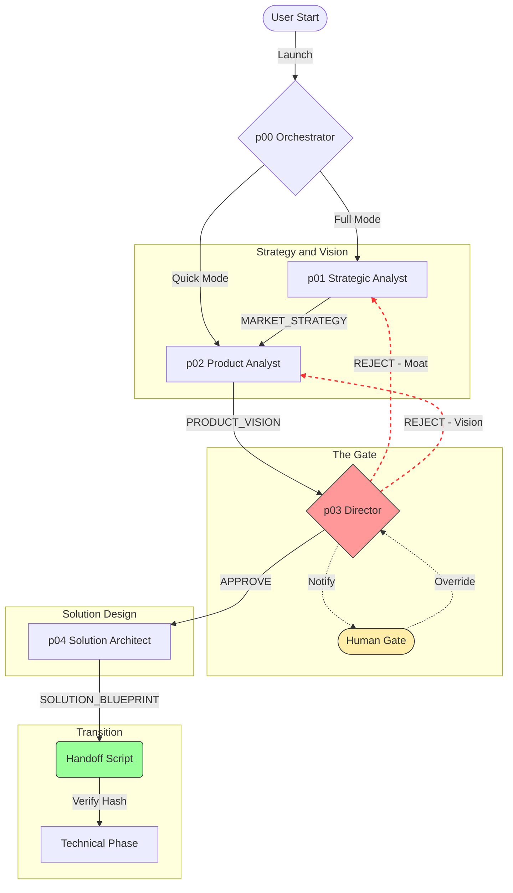

# Product Development Guide & Playbook (v3.9)

## 1. Executive Summary
We have expanded Agentic Development from a "Code Generator" to a **"Full-Cycle Venture Builder"**. This framework now includes a dedicated **Product Discovery Phase** (Agents `p00`-`p04`) that operates strict *Air Gaps* and *Quality Gates* before any technical planning occurs.

**The Goal:** Ensure we are building the *right* product (High ROI, Defensible Moat) before we build it *right*.

## Table of Contents
- [1. Executive Summary](#1-executive-summary)
- [2. Visual Architecture](#2-visual-architecture)
- [3. Core Architecture](#3-core-architecture)
- [4. Agent Definitions](#4-agent-definitions-the-lean-five)
- [5. Handoff Mechanism](#5-handoff-mechanism-the-bridge)
- [6. Workflows](#6-workflows)
- [7. How to Start](#7-how-to-start)
- [8. Artifact Examples](#8-artifact-examples)
- [9. Working Usage Examples](#9-working-usage-examples)

---

## 2. Visual Architecture

### The "Product Discovery" Pipeline
The flow is sequential, strictly gated, and human-supervised.



---

## 3. Core Architecture

### The Pipeline Agents

| Seq | Agent | Role | Output Artifacts | Check / Gate |
|-----|-------|------|------------------|--------------|
| 0 | **p00** | **Product Orchestrator** | *Coordination* | "What mode are we in?" |
| 1 | **p01** | **Strategic Analyst** | `MARKET_STRATEGY.md` | "Market Size deflated? Comp Moat real?" |
| 2 | **p02** | **Product Analyst** | `PRODUCT_VISION.md` | "Does Value Prop match Strategy?" |
| 3 | **p03** | **Product Director** | *Review Comments* | **CRITICAL GATE (Adversarial VDD)** |
| 4 | **p04** | **Solution Architect** | `SOLUTION_BLUEPRINT.md` | "Is UX/ROI feasible?" |
| 5 | **Handoff** | *Scripted Gate* | `docs/TASK.md` + `docs/BRD.md` | "Approved by p03?" |

### File Structure & Isolation
We adopt a **Hybrid Isolation** strategy.
- `docs/product/` -> Owned by `p00`-`p04` (Product Phase).
- `docs/` -> Owned by Technical Agents (`TASK.md`, `ARCHITECTURE.md`).

---

## 4. Agent Definitions (The "Lean Five")

### p00_product_orchestrator
**Role:** The Controller. Entry point for the user.
- **Logic:** Determines the workflow (`Full`, `Quick`, `Market-Only`) based on user intent.

### p01_strategic_analyst
**Role:** The Researcher.
- **Tools:** `skill-product-strategic-analysis`.
- **Output:** `MARKET_STRATEGY.md`.
- **Focus:** Calculates TAM/SAM/SOM and builds Competitive Matrices.

### p02_product_analyst
**Role:** The Visionary.
- **Tools:** `skill-product-analysis`.
- **Output:** `PRODUCT_VISION.md`.
- **Focus:** Defines the "Soul" (Crossing the Chasm), User Stories (INVEST), and Metrics.

### p03_product_director (The Gatekeeper)
**Role:** The Adversarial Critic (VC Proxy).
- **Behavior:** **VDD Mode**. Challenges every claim. "Your moat is weak."
- **Powers:** 
    - Can **REJECT** artifacts (loop back to p01/p02).
    - Can **APPROVE** by generating a cryptographic `APPROVAL_HASH`.
- **Tools:** `skill-product-handoff/scripts/sign_off.py`.

### p04_solution_architect
**Role:** The Pragmatist.
- **Tools:** `skill-product-solution-blueprint`.
- **Output:** `SOLUTION_BLUEPRINT.md`.
- **Focus:** 
    - **ROI:** Cost vs Benefit analysis.
    - **UX:** Text-based flow definitions.
    - **NFRs:** Security and Performance constraints.

---

## 5. Handoff Mechanism (The Bridge)

The handoff is powered by **`skill-product-handoff`** and ensures **Zero Trust** between Product and Tech.

1.  **Strict Gate (`verify_gate.py`):** 
    - Checks `APPROVED_BACKLOG.md` for `APPROVAL_HASH: <UUID>...`.
    - Only `p03` can generate this hash.
2.  **BRD Compilation (`compile_brd.py`):**
    - Automatically merges Strategy, Vision, and Blueprint into a massively detailed `docs/BRD.md`.
3.  **Synthesis Trigger (`trigger_technical.py`):** 
    - Converts the BRD into a technical `docs/TASK.md`.
    - Notifies the user to switch to Technical Agents.

---

## 6. Workflows

| Command | Name | Use Case | Flow |
|---------|------|----------|------|
| `/product-full-discovery` | **Enterprise** | New Products, High Risk | `p00`->`p01`->`p02`->`p03`->`p04` |
| `/product-quick-vision` | **Internal Tool** | Hackathons, Low Risk | `p00`->`p02`->`p03` |
| `/product-market-only` | **Validation** | "Should we do this?" | `p00`->`p01` (Stops) |

---

## 7. How to Start

### Launching via Agent
Simply ask your Orchestrator or Agent:
> "Launch Product Discovery for [Idea Name]."

or use the workflow command:
> "Run /product-full-discovery"

### Example Conversation
**User:** "I want to build a Tinder for Cats."
**Analyst (p01):** "Accessing `skill-product-strategic-analysis`... Let's calculate the TAM for pet social apps."
**Director (p03):** "REJECT. Your 'Swiping Logic' has no moat. Instagram already does this. Add a 'Veterinary Verification' features to make it defensible."

---

## 8. Artifact Examples

### `MARKET_STRATEGY.md`
> **TAM:** $50B. **SAM:** $500M. **Gap:** "Institutional security for retail."

### `PRODUCT_VISION.md`
> **Statement:** "For cat owners who fear loneliness, PurrMatch is a social network that..."

### `SOLUTION_BLUEPRINT.md`
> **ROI:** 3.5x. **Cost:** $24k. **Revenue:** $84k.
> **Risk:** "User safety (Meeting strangers)." -> Mitigation: "ID Verification API".

### `BRD.md` (Compiled)
A single 16-section document containing all of the above, ready for investors or developers.

---

## 9. Working Usage Examples

### Example 1: Full Venture Build (Startup)
**Context:** You have a vague idea for a B2C app and want to ensure it's viable.
**Command:**
```text
Run /product-full-discovery
Input: "I want to build a subscription service for renting high-end Lego sets."
```
**Process:**
1.  **p01** will ask: "What is the TAM? Average Lego set price?" -> generates `MARKET_STRATEGY.md`.
2.  **p02** will ask: "Who is the user? Parents or AFOLs (Adult Fans of Lego)?" -> generates `PRODUCT_VISION.md`.
3.  **p03** will challenge: "Shipping costs will kill your margins. Prove me wrong."
4.  **p04** will calculate: "Shipping = $15/way. Sub = $50/mo. Margin = Thin." -> generates `SOLUTION_BLUEPRINT.md`.

### Example 2: Internal Tool (Quick Vision)
**Context:** You need a simple admin panel for your team. Market research is irrelevant.
**Command:**
```text
Run /product-quick-vision
Input: "Build an Admin Panel for our User Database. Needs 'Ban User' button."
```
**Process:**
1.  **p00** skips Strategy phase.
2.  **p02** drafts Vision: "Goal: Reduce support ticket time by 50%."
3.  **p03** performs light sanity check (Security focus).
4.  **Handoff** compiles BRD and triggers valid technical specs.

### Example 3: VDD Audit (Existing Project)
**Context:** You have existing product docs and want `p03` (Director) to roast them.
**Command:**
```text
@p03_product_director
Task: Audit my docs/product/PRODUCT_VISION.md.
Mode: VDD Adversarial
```
**Output:**
> [!CRITIC]
> **Refusal:** Your "Viral Loop" assumption is mathematically impossible with K < 1.0. Fix metrics before I sign off.

### Example 4: Manual Tool Usage (CLI)
**Context:** You want to generate a specific artifact without the full agent loop.
**Command (Terminal):**
```bash
# Generate a Market Strategy Skeleton
python3 .agent/skills/skill-product-strategic-analysis/scripts/init_strategy.py --industry "Fintech"

# Calculate WSJF Score for Backlog
python3 .agent/skills/skill-product-backlog-prioritization/scripts/calculate_wsjf.py --file docs/product/BACKLOG.md
```
