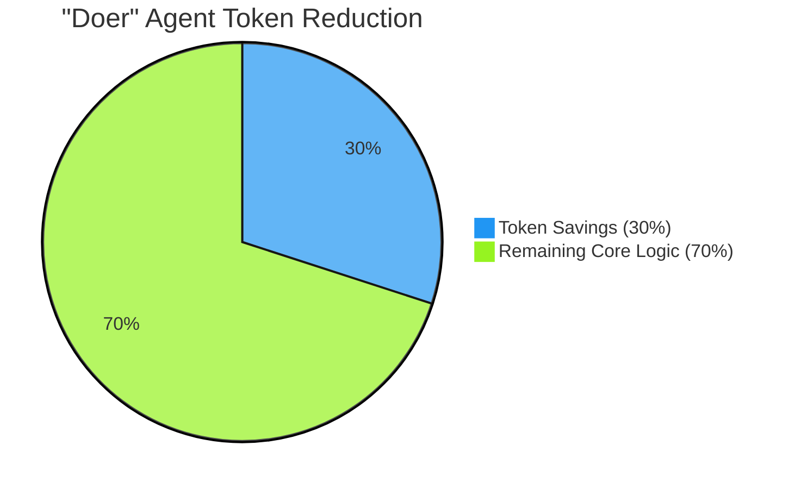
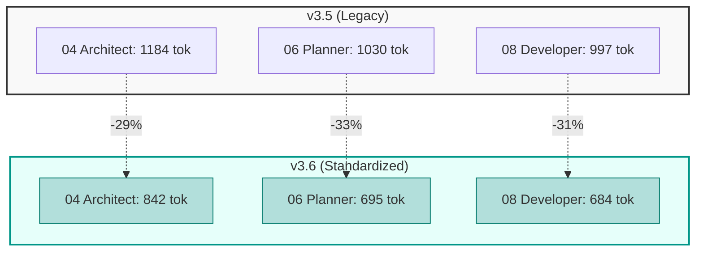
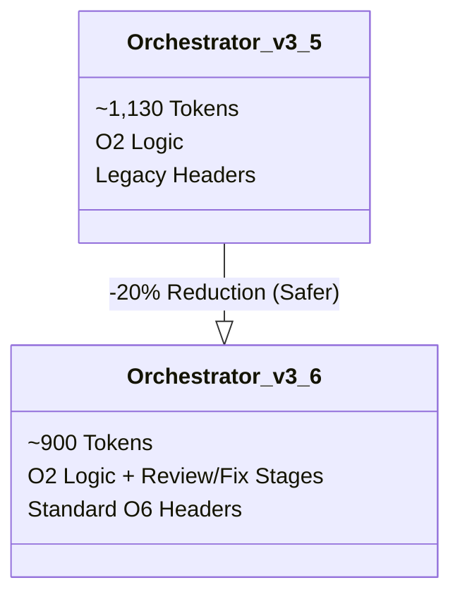
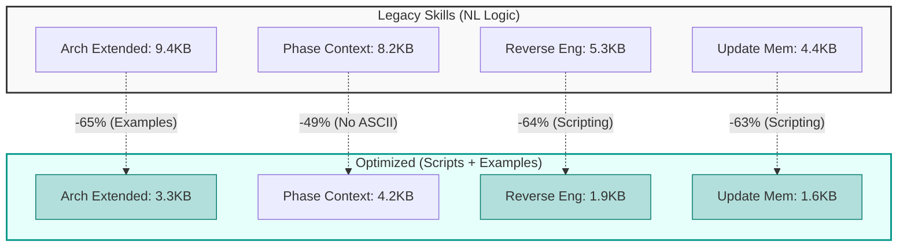

# 📊 O6 & O6a: Framework Optimization Infographic (v3.6.1)

> **Date:** 2026-01-22
> **Scope:** Optimization O6 (Prompt Standardization) & O6a (Skill Structure)
> **Status:** Implemented in v3.6.1

---

## 🚀 Optimization Impact Summary

The **Agent Prompt Standardization (O6)** overhauled all 10 agent personas to enforce a strict "High-Efficiency, High-Safety" header structure. This eliminated massive amounts of redundant boilerplate while simultaneously forcing strict TIER 0 safety compliance.

### The "Doer" Revolution (O6)
Agents that do the heavy lifting (Architect, Planner, Developer) are **30% lighter**. This is critical because these agents typically load large context windows (codebases, logs).

### The "Safety Tax" (Reviewers)
We intentionally **increased** the size of Reviewers (07, 09, 10). Why?
*   **Before:** Reviewers were "lean" but unsafe (missing Anti-Hallucination directives).
*   **After:** Reviewers pay a "Safety Tax" (+43%) to include the mandatory TIER 0 skills (`core-principles`, `safe-commands`).
*   **Net Result:** A reliable system that doesn't hallucinate, even if it costs a few hundred tokens more.

---

## 📉 Data: Before vs After

### 1. Critical "Doer" Agents (Efficiency)
*Lower is Better.*

### 2. The Orchestrator (O2 vs O6)
*Optimization O2 compressed logic. O6 standardized headers.*

---

## 📊 Detailed Metrics Table

| Agent | Role | Delta (Tokens) | Delta (%) | Status | Check |
|-------|------|----------------|-----------|--------|-------|
| `01` | Orch | -230 | **-20.35%** | ✅ Logic Restored | [x] |
| `02` | Analyst | -24 | **-2.35%** | ✅ Optimization | [x] |
| `03` | Task Rev | -79 | **-9.88%** | ✅ Optimization | [x] |
| `04` | Architect | -342 | **-28.86%** | ✅ Major Opt. | [x] |
| `05` | Arch Rev | -29 | **-3.87%** | ✅ Optimization | [x] |
| `06` | Planner | -336 | **-32.56%** | ✅ Major Opt. | [x] |
| `07` | Plan Rev | +217 | +43.63% | ⚠️ Safety Fix* | [x] |
| `08` | Developer | -313 | **-31.39%** | ✅ Major Opt. | [x] |
| `09` | Code Rev | +214 | +43.29% | ⚠️ Safety Fix* | [x] |
| `10` | Security | +481 | +385.0% | ⚠️ Safety Fix* | [x] |

### Key Takeaway
*   **Total Savings (Doers + Orch):** ~1,100 tokens per full execution loop.
*   **Safety Investment (Reviewers/Security):** ~900 tokens added to critical check-points.
*   **Net Impact:** Highly efficient *execution* (where context is tightest) combined with rigorous *checks* (where context is fresher).

---

## 🎯 Strategic ROI

### Why optimize "Doers"?
The Developer (`08`) and Architect (`04`) consume the most tokens because they read the user's codebase. Saving **30%** on their instructions means **30% more codebase context** fits into the model's window.

### Why bloat "Reviewers"?
Reviewers (`07`, `09`) act as gates. If they hallucinate, bad code passes. Adding TIER 0 skills (Anti-Hallucination, Safe Commands) prevents false positives. This "bloat" is actually **Technical Debt Repayment**.

---

## 🛠️ O6a: Skill Structure Optimization (v3.6.1)

> **Date:** 2026-01-22
> **Focus:** Reduction of "Large Skills" (>4KB) via Scripting & Lazy Loading

### Transformation Strategy
We moved from "Natural Language Logic" to "Python Scripts" for deterministic tasks (git diffs, file scanning), and extracted bulky templates into external examples.

### 📉 Token Reduction Results

### 📊 Metric Breakdown

| Skill | Optimization Type | Payoff (Size) | Status |
|-------|-------------------|---------------|--------|
| `architecture-format-extended` | **Examples Extraction** | **-65%** | ✅ Verified |
| `skill-reverse-engineering` | **Python Scripting** | **-64%** | ✅ Verified |
| `skill-update-memory` | **Python Scripting** | **-63%** | ✅ Verified |
| `skill-phase-context` | **Refinement** | **-49%** | ✅ Verified |

### Key Takeaway (O6a)
*   **Determinism:** Python scripts (`scan_structure.py`) are 100% accurate, whereas LLM file traversal was flaky.
*   **Lazy Loading:** Huge templates are now in `examples/` and only read when specifically requested.

---

## 🧠 Model Performance Impact

> **Context Efficiency:** How O6a affects "Thinking" models (Claude 3.5 Sonnet / Opus) during complex tasks.

When performing **High-Complexity Tasks** (e.g., "Reverse Engineer and Document this Service"), the agent must load multiple TIER 2 skills.

| Scenario | Load (Legacy) | Load (Optimized) | **Space Gained** | Impact on "Thinking" Models |
| :--- | :---: | :---: | :---: | :--- |
| **Full Architecture Generation** *(Arch Ext + Phase Context)* | ~4,400 tokens | ~1,875 tokens | **+2,525 tokens** | **Reduced Truncation** Additional space for CoT reasoning |
| **Reverse Engineering** *(Rev Eng + Memory Update)* | ~2,425 tokens | ~875 tokens | **+1,550 tokens** | **Higher Accuracy** Less distraction from framework instructions |

### Why this matters for CoT (Chain of Thought):
"Thinking" models suffer when system instructions are verbose. By reducing the skill definitions by **>60%**, we reduce the "noise" in the model's attention mechanism, allowing it to focus better on the **User's Code**.

---

## 🔗 References

*   **Official Documentation:** [Antigravity Skills Docs](https://antigravity.google/docs/skills)
*   **Standards & Best Practices:** [Skill Creator Guide](https://github.com/anthropics/skills/blob/main/skills/skill-creator/SKILL.md)

