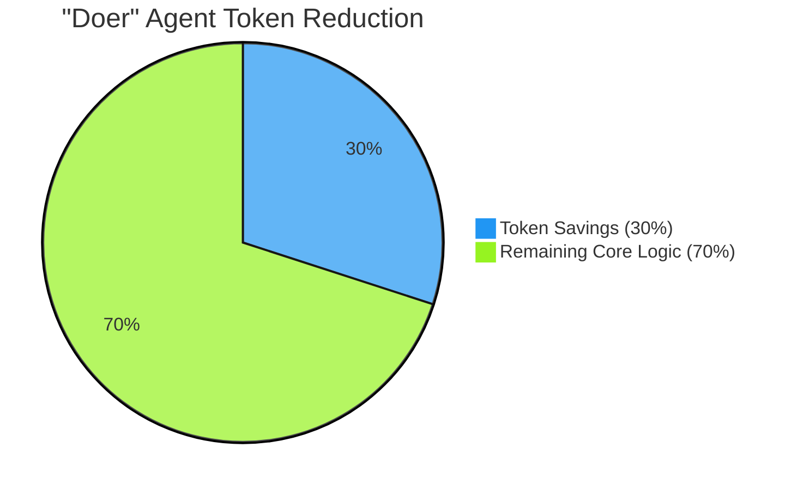
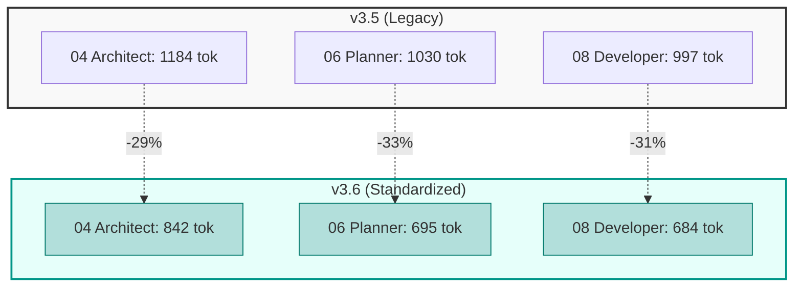
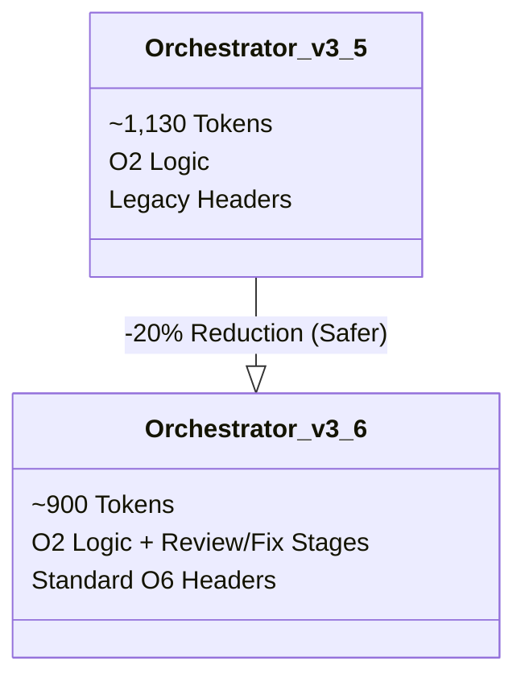

# 📊 O6: Agent Prompt Standardization Infographic (v3.6.0)

> **Date:** 2026-01-22
> **Scope:** Optimization O6 (Standardization of Agents 01-10)
> **Status:** Implemented in v3.6.0

---

## 🚀 Optimization Impact Summary

The **Agent Prompt Standardization (O6)** overhauled all 10 agent personas to enforce a strict "High-Efficiency, High-Safety" header structure. This eliminated massive amounts of redundant boilerplate while simultaneously forcing strict TIER 0 safety compliance.

### The "Doer" Revolution (O6)
Agents that do the heavy lifting (Architect, Planner, Developer) are **30% lighter**. This is critical because these agents typically load large context windows (codebases, logs).

### The "Safety Tax" (Reviewers)
We intentionally **increased** the size of Reviewers (07, 09, 10). Why?
*   **Before:** Reviewers were "lean" but unsafe (missing Anti-Hallucination directives).
*   **After:** Reviewers pay a "Safety Tax" (+43%) to include the mandatory TIER 0 skills (`core-principles`, `safe-commands`).
*   **Net Result:** A reliable system that doesn't hallucinate, even if it costs a few hundred tokens more.

---

## 📉 Data: Before vs After

### 1. Critical "Doer" Agents (Efficiency)
*Lower is Better.*

### 2. The Orchestrator (O2 vs O6)
*Optimization O2 compressed logic. O6 standardized headers.*

---

## 📊 Detailed Metrics Table

| Agent | Role | Delta (Tokens) | Delta (%) | Status | Check |
|-------|------|----------------|-----------|--------|-------|
| `01` | Orch | -230 | **-20.35%** | ✅ Logic Restored | [x] |
| `02` | Analyst | -24 | **-2.35%** | ✅ Optimization | [x] |
| `03` | Task Rev | -79 | **-9.88%** | ✅ Optimization | [x] |
| `04` | Architect | -342 | **-28.86%** | ✅ Major Opt. | [x] |
| `05` | Arch Rev | -29 | **-3.87%** | ✅ Optimization | [x] |
| `06` | Planner | -336 | **-32.56%** | ✅ Major Opt. | [x] |
| `07` | Plan Rev | +217 | +43.63% | ⚠️ Safety Fix* | [x] |
| `08` | Developer | -313 | **-31.39%** | ✅ Major Opt. | [x] |
| `09` | Code Rev | +214 | +43.29% | ⚠️ Safety Fix* | [x] |
| `10` | Security | +481 | +385.0% | ⚠️ Safety Fix* | [x] |

### Key Takeaway
*   **Total Savings (Doers + Orch):** ~1,100 tokens per full execution loop.
*   **Safety Investment (Reviewers/Security):** ~900 tokens added to critical check-points.
*   **Net Impact:** Highly efficient *execution* (where context is tightest) combined with rigorous *checks* (where context is fresher).

---

## 🎯 Strategic ROI

### Why optimize "Doers"?
The Developer (`08`) and Architect (`04`) consume the most tokens because they read the user's codebase. Saving **30%** on their instructions means **30% more codebase context** fits into the model's window.

### Why bloat "Reviewers"?
Reviewers (`07`, `09`) act as gates. If they hallucinate, bad code passes. Adding TIER 0 skills (Anti-Hallucination, Safe Commands) prevents false positives. This "bloat" is actually **Technical Debt Repayment**.
