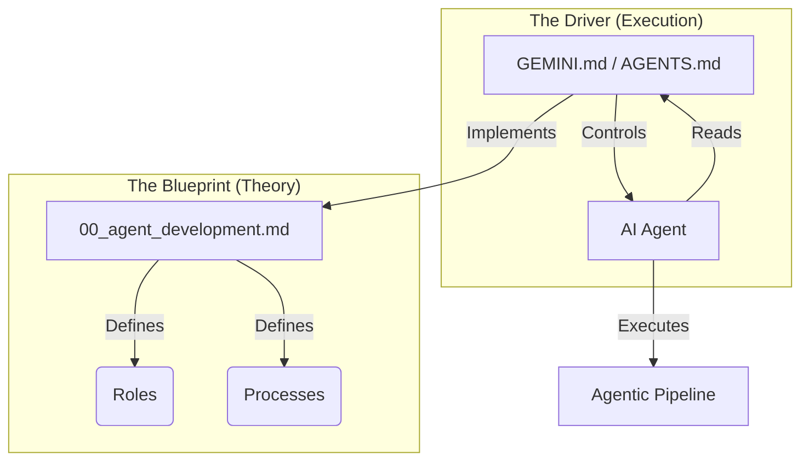

# Implementation Plan - Documentation Extension

## Goal
Extend the framework documentation to support **Claude Code** and **Gemini CLI**, and clarify the core concepts of the Agentic System (`00_agent_development.md` vs `GEMINI/AGENTS.md`).

## Proposed Changes

### 1. Update `README.md` (English)
- **New Section**: "Installation & Setup" -> "2. Choose Your AI Assistant"
    *   Add "Option C: Claude Code (Native)" with detailed setup steps (symlinks).
    *   Add "Option D: Gemini CLI" with setup steps.
- **New Section**: "System Overview" -> "Concept Deep Dive"
    *   Explain the "Blueprint vs Driver" concept.
    *   Use a comparison table (from Backlog).
    *   Add a Mermaid diagram to visualize the relationship.
- **New Section**: "Practical Usage"
    *   Add scenarios for Claude Code (Standard, Light, Resume).

### 2. Update `README.ru.md` (Russian)
- Mirror all changes from `README.md` in Russian.

### 3. Verification Plan
- **Manual Verification**:
    *   Render `README.md` and `README.ru.md` in a markdown viewer.
    *   Check broken links.
    *   Verify the Mermaid diagram syntax.

## Conceptual Visualization (Draft)

## Detailed Steps

1.  **[DOCS]** Edit `README.md`:
    *   Insert "Choose Your AI Assistant" updates.
    *   Insert "Concept Deep Dive".
    *   Insert "Practical Usage".
2.  **[DOCS]** Edit `README.ru.md`:
    *   Translate and insert the same sections.
3.  **[VERIFY]** Review rendered markdown.
