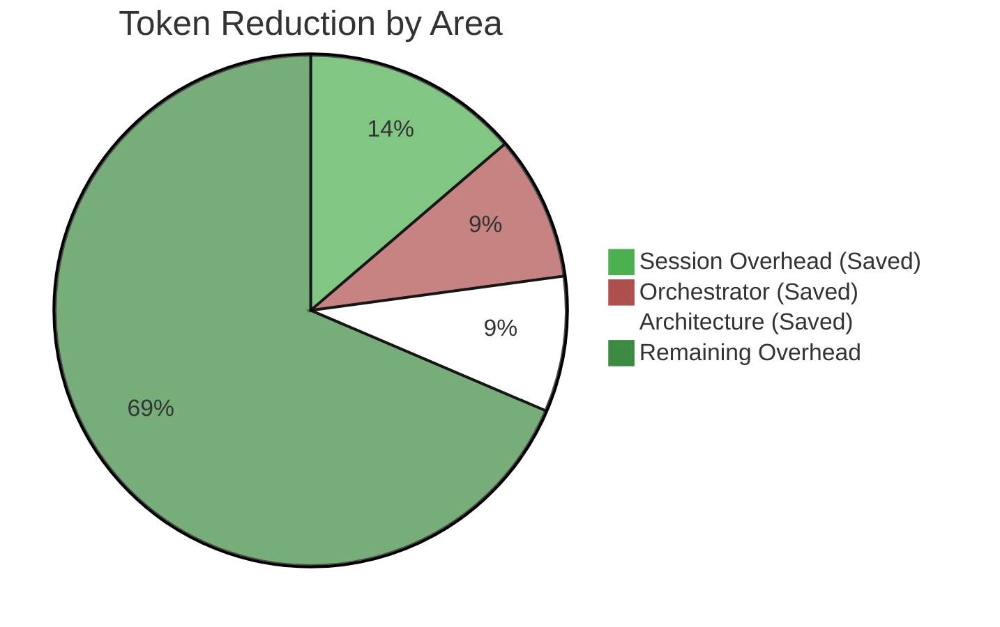
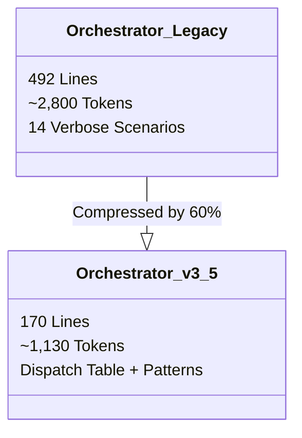

# 📊 Token Optimization Infographic (v3.5.x)

> **Date:** 2026-01-21
> **Scope:** Optimizations O1, O2, O3
> **Status:** Implemented in v3.5.3 - v3.5.5

---

## 🚀 Savings at a Glance

Significant reduction in token overhead across the entire development lifecycle.

| Metric | Before | After | Savings | Impact |
|--------|--------|-------|---------|--------|
| **Session Bootstrap** | ~6,900 | ~4,500 | **-35%** | Faster startup, cheaper sessions |
| **Orchestrator** | ~2,800 | ~1,130 | **-60%** | More context for user tasks |
| **Initial Skills** | ~9,772 | ~2,082 | **-79%** | Massive reduction in noise |
| **Standard Pipeline** | ~50,000 | ~42,000 | **-16%** | Cheaper end-to-end features |

---

## 📉 Visual Comparison: Before vs After

### 1. Session Bootstrap (Initial Context)
*Optimization O1 (Phased Loading)*

### 2. Orchestrator Efficiency
*Optimization O2 (Pattern Compression)*

---

## 🛠 Detail by Optimization

### **O1: Lazy Loading Protocol (v3.5.4)**
> **Logic:** "Don't load what you don't use right now."

- **TIER 0 (Always):** `core-principles`, `safe-commands` (Automation preserved).
- **TIER 1 (On-Demand):** Loaded only when entering Analysis, Architecture, etc.
- **Result:** Session start is **4x lighter**.

### **O2: Orchestrator Compression (v3.5.5)**
> **Logic:** "Don't repeat yourself 14 times."

- **Before:** 14 distinct scenarios with repeated boilerplate.
- **After:** 1 `Stage Cycle` pattern + 1 `Dispatch Table`.
- **Result:** Saves ~1,600 tokens per request (since Orchestrator is always in context).

### **O3: Architecture Format Split (v3.5.3)**
> **Logic:** "Don't force a skyscraper blueprint for a doghouse."

- **Core:** Light template (~996 tokens) for day-to-day tasks.
- **Extended:** Full template (~3,357 tokens) only for new systems.
- **Default:** Core (Savings: **-60%** for standard tasks).

---

## 🔮 Projected Cumulative Impact

For a typical developer day (10 sessions, 50 requests):

- **Tokens Saved:** ~150,000 tokens / day
- **Cost Reduction:** ~20-30% on input costs
- **Context Window:** +10,000 tokens available for code / documentation

> *Data verified against v3.5.5 benchmarks (2026-01-21).*
