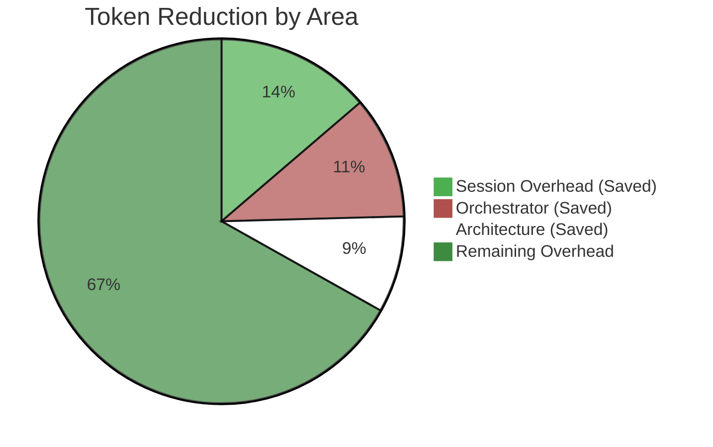
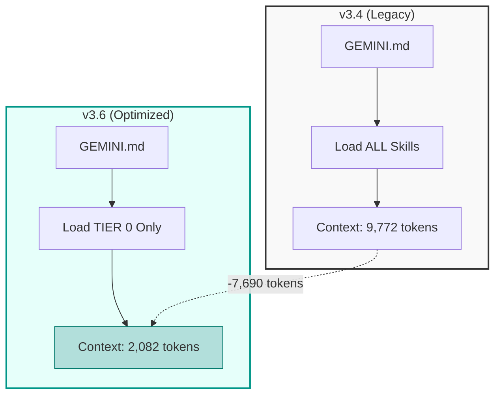
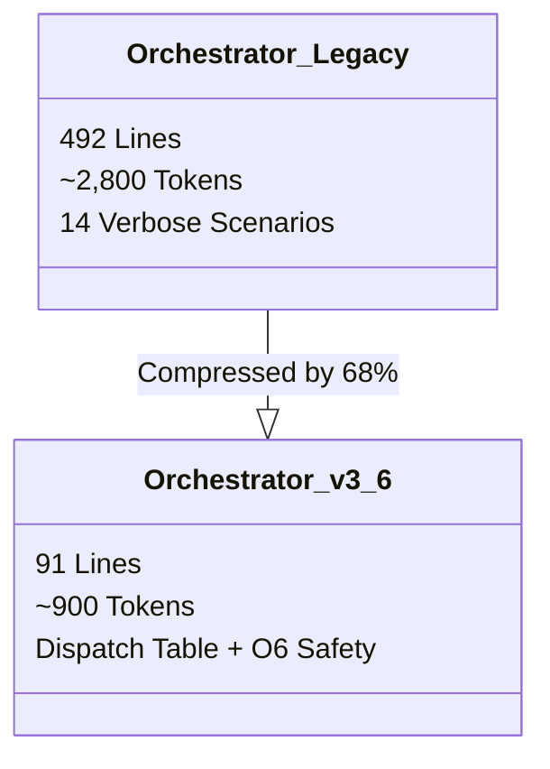

# 📊 Token Optimization Infographic (v3.6.0)

> **Date:** 2026-01-22
> **Scope:** Optimizations O1, O2, O3, O6
> **Status:** Implemented in v3.6.0

---

## 🚀 Savings at a Glance

Significant reduction in token overhead across the entire development lifecycle.

### Understanding the Charts
The **Pie Chart** below illustrates "Tokens Saved" vs "Remaining Overhead". The saved portions represent context window space that is now available for your code, rather than being consumed by framework instructions.
- **Session Overhead (Saved):** Reduction in initial prompt size.
- **Orchestrator (Saved):** Compression of the main control logic.
- **Architecture (Saved):** Savings from using the lightweight Core template.

| Metric | Before | After (v3.6) | Savings | Impact |
|--------|--------|-------|---------|--------|
| **Session Bootstrap** | ~6,900 | ~4,500 | **-35%** | Faster startup, cheaper sessions |
| **Orchestrator** | ~2,800 | ~900 | **-68%** | More context for user tasks |
| **Initial Skills** | ~9,772 | ~2,082 | **-79%** | Massive reduction in noise |
| **Standard Pipeline** | ~50,000 | ~41,500 | **-17%** | Cheaper end-to-end features |

---

## 📉 Visual Comparison: Before vs After

### 1. Session Bootstrap (Initial Context)
*Optimization O1 (Phased Loading)*

> **User Impact:** Sessions start faster and cost significantly less. Previously, every new session loaded ~10k tokens of instructions. Now, it loads only ~2k, allowing you to fit ~7,000 more tokens of *your code* in the initial context window.

### 2. Orchestrator Efficiency
*Optimization O2 + O6 (Pattern Compression)*

> **User Impact:** The Orchestrator is the "brain" present in every single turn of conversation. By compressing it, we free up ~1,900 tokens *per message*. Over a long conversation (e.g., 50 turns), this accumulates to massive savings and prevents the model from "forgetting" earlier instructions due to context sliding.

---

## 🛠 Detail by Optimization

### **O1: Lazy Loading Protocol (v3.5.4)**
> **Logic:** "Don't load what you don't use right now."

- **TIER 0 (Always):** `core-principles`, `safe-commands` (Automation preserved).
- **TIER 1 (On-Demand):** Loaded only when entering Analysis, Architecture, etc.
- **Result:** Session start is **4x lighter**.

### **O2: Orchestrator Compression (v3.5.5)**
> **Logic:** "Don't repeat yourself 14 times."

- **Before:** 14 distinct scenarios with repeated boilerplate.
- **After:** 1 `Stage Cycle` pattern + 1 `Dispatch Table`.
- **Result:** Saves ~1,600 tokens per request (since Orchestrator is always in context).

### **O3: Architecture Format Split (v3.5.3)**
> **Logic:** "Don't force a skyscraper blueprint for a doghouse."

- **Core:** Light template (~996 tokens) for day-to-day tasks.
- **Extended:** Full template (~3,357 tokens) only for new systems.
- **Default:** Core (Savings: **-60%** for standard tasks).

---

## 🔮 Projected Cumulative Impact

For a typical developer day (10 sessions, 50 requests):

- **Tokens Saved:** ~150,000 tokens / day
- **Cost Reduction:** ~20-30% on input costs
- **Context Window:** +10,000 tokens available for code / documentation

> *Data verified against v3.5.5 benchmarks (2026-01-21).*

---

## � Context Efficiency & ROI Analysis

### The Problem: "Context Starvation"
In agentic development, the **Framework Overhead** (System Prompts, Skills, Tools) acts as a "tax" on every request.
*   **Legacy Framework:** Consumed **~16,000 tokens** per request layout.
*   **Result:** On smaller or "thinking" models, this left little room for the actual code context, leading to "forgetfulness" and hallucinations.

### 🧮 Model Breakdown: Framework vs. Development Space

We analyzed the impact on popular 2026 models, split by their Context Window constraints.

| Model Tier | Context Window | Framework Cost (Legacy) | Framework Cost (Optimized) | **Dev Space Gained** |
| :--- | :---: | :---: | :---: | :---: |
| **Gemini (High)** *(2M tokens)* | 2,000,000 | 0.8% | **0.2%** | Negligible (but faster) |
| **Gemini (Low)** *(128k tokens)* | 128,000 | 12.5% | **2.5%** | **+13,000 tokens** *(~2-3 files)* |
| **Claude Sonnet 4.5** *(Ordinary - 500k)* | 500,000 | 3.2% | **0.8%** | **+12,800 tokens** *(Efficiency)* |
| **Claude Sonnet 4.5** *(Thinking - 200k)* | 200,000 | 8.0% | **2.0%** | **CRITICAL** *Reduces "thought" truncation* |
| **Claude Opus 4.5** *(Thinking - 100k)* | 100,000 | **16.0%** | **4.0%** | **GAME CHANGER** *Moves from "Unusable" to "Stable"* |

> **Why "Thinking" Models Matter:**
> Models with "Thinking" (CoT) capabilities generate massive internal hidden chains. A high input overhead (Legacy 16k) forces the model to truncate its thinking process earlier to fit the output limits, directly degrading intelligence.
> **Optimization O1-O3** liberates ~12k tokens, giving the model significantly more "brain power" headroom.

---

## �📐 Methodology

How we measured these savings:

1.  **Token Counting:**
    *   Used `tiktoken` (cl100k_base encoding) to measure exact token counts of files.
    *   **Orchestrator:** Measured `01_orchestrator.md` (v3.4) vs `01_orchestrator.md` (v3.5).
    *   **Skill Loading:** Summed tokens of all `SKILL.md` files loaded by default in v3.4 vs TIER 0 skills in v3.5.

2.  **Pipeline Emulation:**
    *   Simulated a standard "Start Feature" workflow (Analysis → Architecture → Planning).
    *   **Before:** Assumed full loading of all instructions at session start.
    *   **After:** Calculated cumulative load based on phase entry triggers (e.g., Architecture skills only load at Step 2).

3.  **Real-World Validation:**
    *   Executed `Task 036 (O1-O3 Validation)` to verify that skills load *only* when requested and automation tools still function correctly.
    *   Peak usage estimates based on a context window limit of 200k tokens (Anthropic Claude 3.5 Sonnet).
