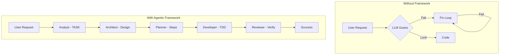

# Design Doc: Framework Evolution Presentation (Task 052)

## 1. Goal
Create a compelling Markdown presentation ("pitch deck") to showcase the Agentic Framework's evolution, capabilities, and impact.
**Audience:** Potential users, developers, and stakeholders.
**Key Takeaway:** "This framework transforms chaotic LLM coding into a structured, verifiable, and scalable engineering process."

## 2. Narrative Arc
1.  **The Origin**: From chaos to structure (v1).
2.  **The Evolution**: Systematizing the intelligence (Skills, Tiers, VDD).
3.  **The Optimization**: Making it efficient (O1-O7).
4.  **The Expansion**: From Coding to Product Building (Phase 0).
5.  **The Proof**: Metrics and Comparisons.

## 3. Structure Draft (Slides)

### Section 1: Introduction & Vision
*   **Slide 1: Title**. "Agentic Framework: Engineering the Future of AI Coding".
*   **Slide 2: The Problem**. LLMs are messy, non-deterministic, and context-hungry.
*   **Slide 3: The Solution**. A rigorous, multi-agent system with Verification-Driven Development (VDD).

### Section 2: Timeline of Quality (Infographic)
*   **Slide 4: Evolution Roadmap**.
    *   *v1.0*: Basic Personas.
    *   *v2.0*: Orchestrator & Multi-Agent.
    *   *v3.0*: Skills System (The Game Changer).
    *   *v3.5*: Optimization & Tiers.
    *   *v3.8*: Product Phase.
    *   *v3.9*: Self-Improvement & Hardening.

### Section 3: Core Features (The "Why")
*   **Slide 5: The Brain (Orchestrator)**. Logic-driven, not Just chat.
*   **Slide 6: The Hands (Skills)**. Modular, testable, strictly defined capabilities.
*   **Slide 7: The Conscience (VDD)**. Adversarial testing, Security Audits, "Trust but Verify".

### Section 4: Comparison (With vs Without)
*   **Slide 8: The Difference**.
    *   *Without*: "Fix this bug" -> Hallucination -> Loop -> Frustration.
    *   *With*: Analysis -> Plan -> Stub -> Implement -> Verify -> Success.

### Section 5: Optimization & Metrics (The "Data")
*   **Slide 9: Optimization Impact**.
    *   Orchestrator Compression: -60% tokens.
    *   Session Load: -79% tokens.
    *   Speed: Deterministic Tools vs Chat.

## 4. Comparisons & Infographics

### A. Process Comparison

### B. Token Optimization Stats (Real Data from CHANGELOG)
| Metric | Before Optimization | After Optimization | Improvement |
| :--- | :--- | :--- | :--- |
| **Session Bootstrap** | ~9,772 tokens | ~2,082 tokens | **-79%** |
| **Orchestrator Prompt** | 492 lines | 170 lines | **-65%** |
| **Architecture Update** | ~2,535 tokens | ~996 tokens | **-60%** |

## 5. Visual Style
*   Use "GitHub-Style" Admonitions for emphasis.
*   Use Mermaid charts for flows.
*   Use Clean tables for data.
*   Emojis for visual anchoring (🚀, 🛡️, 📉).

## 6. Next Steps
1.  Generate `docs/presentation/FRAMEWORK_EVOLUTION.md`.
2.  Embed the Mermaid diagrams.
3.  Fill in the content from CHANGELOG/Git history.
