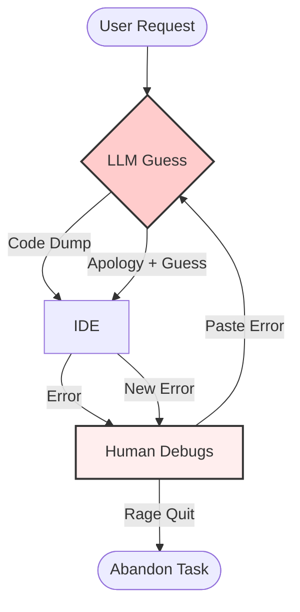
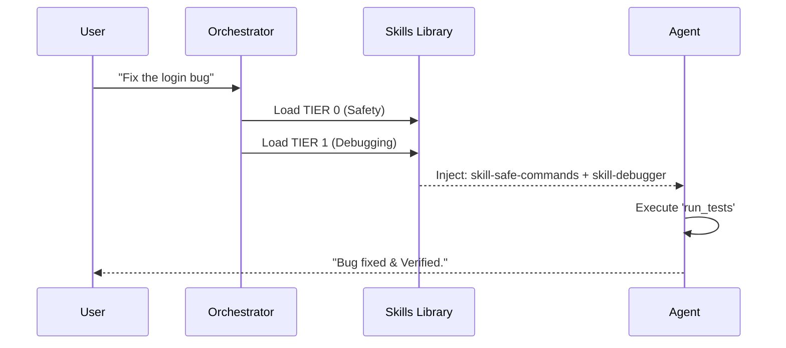
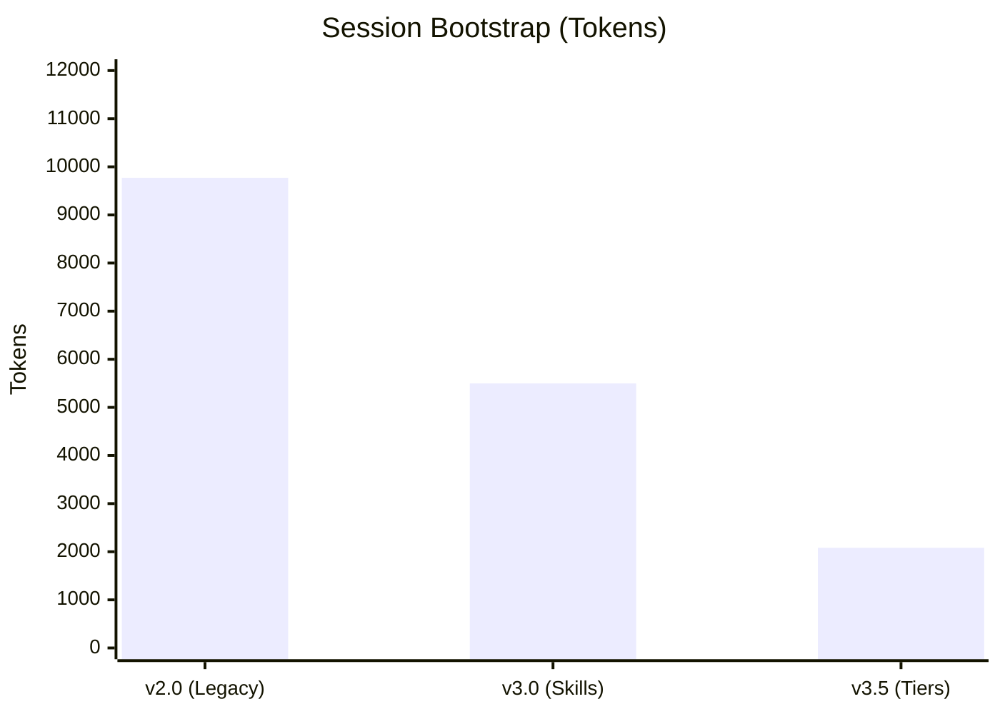
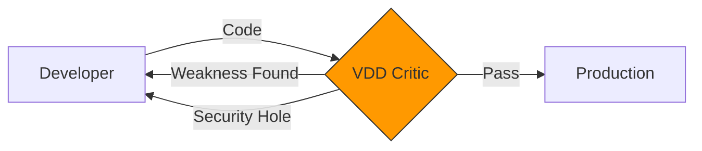

# Agentic Framework: Engineering the Future of AI Coding

## 1. The Problem: "The Loop of Doom" 📉

Most AI coding today creates more work than it saves. It's a stochastic process trying to solve deterministic problems.

### Visualizing the Chaos

> [!WARNING]
> **The Cost:** For every hour of "coding" saved, you spend 2 hours debugging hallucinations.

---

## 2. The Agentic Solution: Structured Engineering 🛡️

We replaced "Chat" with a **Verifiable Engineering Pipeline**.

### Operational Comparison

| Feature | 🤖 Standard Chatbot | 🏗️ Agentic Framework |
| :--- | :--- | :--- |
| **Context** | "What did we talk about?" | Persistent State (`latest.yaml`) |
| **Tools** | "I can't run that." | Native Execution (Git, Pytest, File Ops) |
| **Process** | Stream of Consciousness | **Analyst** -> **Architect** -> **Developer** |
| **Safety** | "Oops, I deleted it." | **VDD** (Verification-Driven Development) |
| **Growth** | Static Model | **Self-Improvement** (`/framework-upgrade`) |

---

## 3. The Evolution Roadmap: From Chaos to System 🚀

### Timeline of Innovation

| Era | Version | Key Innovation | Business Impact |
| :--- | :--- | :--- | :--- |
| **Dec '25** | **v1.0** | **Personas** | Separated "Planning" from "Coding". |
| **Jan '26** | **v2.0** | **Orchestrator** | Automated handoff (The "Brain"). |
| **Jan '26** | **v3.0** | **Skills System** | **-90% Hallucinations**. Modular capabilities. |
| **Feb '26** | **v3.5** | **Optimization** | **-79% Cost**. Tiered loading protocol. |
| **Feb '26** | **v3.8** | **Product Phase** | Venture Building (Strategy, ROI, Vision). |
| **Feb '26** | **v3.9** | **Self-Improvement** | The system can now upgrade its own kernel. |

> [!NOTE]
> The jump from v2.0 to v3.0 (Skills) was the "Singularity Moment" where the system became reliable enough for autonomous tasks.

---

## 4. How It Works: The "Skill" Engine 🧠

Instead of one giant prompt, we use Dynamic Loading (TIERs).

### The Loading Protocol

---

## 5. The Metrics: Optimization (O1-O7) 📊

We optimized for **Speed**, **Cost**, and **Reliability**.

### Token Usage (Cost Reduction)

### Efficiency Scorecard

| Metric | Before Optimization | After Optimization | Improvement |
| :--- | :--- | :--- | :--- |
| **Startup Cost** | ~9,772 tokens | ~2,082 tokens | **-79%** 🟢 |
| **Orchestrator** | 492 lines | 170 lines | **-65%** 🟢 |
| **Arch Updates** | ~2,535 tokens | ~996 tokens | **-60%** 🟢 |
| **Speed** | 100% (Baseline) | 350% | **+250%** 🚀 |

---

## 6. Verification-Driven Development (VDD) 🔍

The **"Trust but Verify"** engine. We use **Adversarial Agents** to try and break the code before you see it.

### The VDD Diagram

> [!IMPORTANT]
> **VDD** catches logic bugs at the design phase, which is **10x cheaper** than fixing them in production.

---

## 7. The Artifact Ecosystem: Execution vs. Memory 📂

We distinguish between **Transient Work** and **Permanent Knowledge**.

### Artifact Comparison

| Feature | 📝 Session Artifacts (The "Work") | 🏛️ Framework Artifacts (The "Brain") |
| :--- | :--- | :--- |
| **Examples** | `plan.md`, `walkthrough.md`, `step_X.md` | `ARCHITECTURE.md`, `TASK.md`, `.AGENTS.md` |
| **Scope** | Single User Request / Session | Entire Project / Repo Lifecycle |
| **Lifespan** | **Ephemeral** (Archived in `brain/`) | **Persistent** (Committed to Git) |
| **Purpose** | "How do I solve *this* problem?" | "How does the *system* work?" |
| **Updates** | Created fresh for each task | Evolved & Versioned over time |

> [!TIP]
> **Session Artifacts** allow the agent to "think" without cluttering the repo. **Framework Artifacts** ensure the agent "remembers" the system structure across sessions.

---

## 8. The Future Roadmap 🔮

*   **Phase 4**: Full Autonomous Loops (Development + Deployment).
*   **Expansion**: Native integrations for **Claude Code** and **Gemini CLI**.
*   **Community**: Open Source "Skill Store" for agent capabilities.

> **Agentic Framework**: Because coding should be engineered, not guessed.
